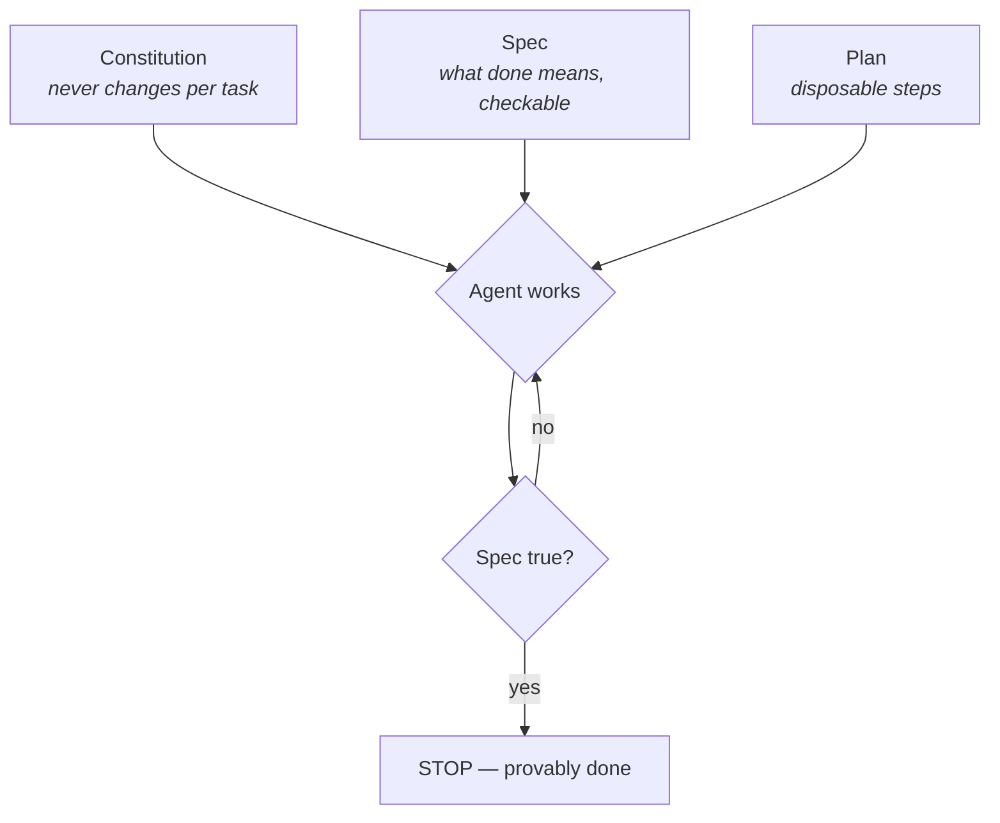

# Spec-Driven Primer

> Why "make it better" fails and "make this condition true" works — the thinking
> behind every stopping condition in this course.

## The hook

Two engineers hand the same bug to the same agent. One says: *"fix the flaky auth
test."* The other says: *"make `npm test` pass 10 consecutive runs with no changes to
the test files."* The first gets back something that *looks* fixed. The second gets
back something that **provably is** — and can walk away while it happens. The entire
difference is a spec.

## Vibe vs. spec (plain English)

**Vibe-driven** work steers by feel: prompt, look at the result, prompt again. It's
fine when you're present, fatal when you're not — a loop can't ask your gut anything
at 3 a.m.

**Spec-driven** work states, up front and in checkable terms, what "done" means. The
spec has three layers:

1. **The constitution** — standing rules that never change per-task (your rules file:
   "never disable tests", "never touch `.env`").
2. **The spec** — what must become true for *this* task ("all links in `docs/` resolve").
3. **The plan** — steps the agent proposes to satisfy the spec (disposable; regenerate
   at will).



## The 4-phase method

| Phase | You produce | Test of quality |
| --- | --- | --- |
| 1 · Specify | What & why, in checkable statements | Could a machine grade it? |
| 2 · Plan | How — architecture, constraints | Does it honor the constitution? |
| 3 · Tasks | Small, independently verifiable chunks | Can each be checked alone? |
| 4 · Implement | Working output, checked per task | Does the spec pass — not "does it feel done"? |

## Write one now

```claude
# Claude Code: plan mode is the spec-writing surface (shift+tab or /plan)
claude
> /plan Make every relative link in docs/ resolve. Done = a link checker
> exits 0. Constraint: never edit files outside docs/.
```

```opencode
# OpenCode: use the plan agent before letting the build agent touch files
opencode
> switch to plan: define done for "fix the docs links" as a command that exits 0,
> list the tasks, then wait for my approval.
```

> [!NOTE]
> **Going deeper:** in loop terms the spec *is* the stopping condition — Part 2 turns
> this idea into the three stops every loop declares (success, limit, no-progress).
> This repo's own Day 1 spec lives in `shared/goal.md` — it's a definition of done,
> not a to-do list.

## Check yourself

**Q: "Stop when the code is clean" — what's wrong with that spec, and what's the
smallest fix?**

<details><summary>Answer</summary>

"Clean" isn't machine-checkable — the loop either never stops or stops on a feeling.
Smallest fix: name the checker — e.g. *"stop when `npm run lint` exits 0"*. If no
tool can verify it, it's a vibe, not a spec.

</details>

## Try With AI

Take any small chore in your sandbox repo and write it three times:

> 1. As a vibe: "improve the error handling."
> 2. As a spec: "every `catch` block logs the error and the process never exits 0 on failure — verified by `npm test`."
> 3. Ask your agent to critique both and say which it could work on unattended, and why.

Keep the agent's answer — it's the same reasoning you'll use to grade every loop you
design in this course.

## When it goes wrong

| Symptom | Cause | Fix |
| --- | --- | --- |
| Agent declares victory, work isn't done | Spec wasn't checkable ("feels done") | Restate done as a command with an exit code |
| Agent satisfies the letter, breaks the spirit | Spec without a constitution | Add standing rules: what must never change |
| Perfect spec, chaotic execution | Skipped the plan/tasks phases | Break the work into independently verifiable chunks |
| Spec keeps growing mid-run | Scope creep in disguise | Freeze the spec; new wants become the *next* spec |

---

*Attribution: this page condenses ideas from Panaversity's Spec-Driven Development
chapter (source 3 in [../../resources/sources.md](../../resources/sources.md)).*

*Glossary terms used on this page:* **spec**, **constitution**, **stopping condition** —
see [../00-foundations/glossary.md](../00-foundations/glossary.md).
