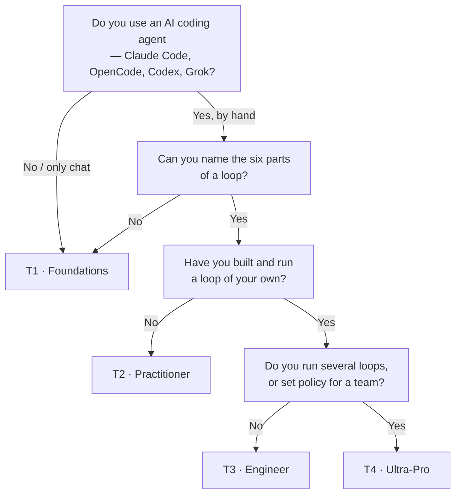

# Start Here — the 60-second router

> You're one honest answer away from knowing exactly where to begin. No account, no
> placement test — just read the four questions below.

## The hook

Two developers open this course. One has never let an AI agent run unsupervised; the
other already has a cron job that triages issues overnight. If they both start at page
one, the first drowns and the second yawns. This router exists so neither happens to you.

## How the course is organized (plain English)

The course is a **graded curriculum with four tracks**, not a flat pile of pages. Each
track has an entry check ("you start knowing…"), a body of study, hands-on labs, and an
exit assessment. You graduate a track by *building* something, not by reading.

## Find your track



| Your answer | Go to | First stop |
| --- | --- | --- |
| "I prompt an AI by hand (or not at all)" | **T1 · Foundations** | [prerequisites/environment-setup.md](prerequisites/environment-setup.md) |
| "I know the six parts, never shipped a loop" | **T2 · Practitioner** | Part 2 · The Heartbeat *(opens Day 2)* |
| "I've shipped one loop" | **T3 · Engineer** | Part 5 · A Complete Loop *(opens Day 2)* |
| "I run fleets / set team policy" | **T4 · Ultra-Pro** | `advanced/` *(opens Day 3)* |

Full track map with entry checks and exit assessments:
[learning-tracks.md](learning-tracks.md)

## Check your tool is ready

Whichever track you land on, you need one agent installed. Verify in 10 seconds:

```claude
# Claude Code
claude --version
```

```opencode
# OpenCode
opencode --version
```

Neither installed? → [prerequisites/environment-setup.md](prerequisites/environment-setup.md)

> [!NOTE]
> **Going deeper:** unsure what "the six parts of a loop" even means? That's a T1
> signal — and a fine one. The whole vocabulary is built up gently in
> [00-foundations/mental-models.md](00-foundations/mental-models.md).

## Check yourself

**Q: You've used Claude Code daily for months, but every run is you typing a prompt and
watching it work. Which track?**

<details><summary>Answer</summary>

**T2 · Practitioner.** Daily hand-driven use means the prerequisites and foundations
will be quick review, but you haven't yet built an autonomous loop — that's exactly
what T2 teaches. (If the phrase "six parts of a loop" means nothing to you, skim
T1's foundations pages first.)

</details>

## Try With AI

Ask your agent, in any repo you don't care about:

> "Read this repo and propose ONE task you could safely do repeatedly on a schedule,
> with a provable condition for when to stop."

You're not running anything yet — you're checking whether *you* can judge if its answer
has a real stopping condition. That judgment is the course's core skill.

## When it goes wrong

| Symptom | Cause | Fix |
| --- | --- | --- |
| "Every track feels partly right" | Skills are lopsided (deep on tools, new to loops) | Take the *lowest* track that has anything new; entry checks are fast |
| "T1 feels too slow" | You skipped the entry check | Each track lists what you may skip — skip pages, not labs |
| "I picked T3 and I'm lost" | Missing the Part 2–4 vocabulary | Drop back one track; the exit assessment will confirm when you're ready |

---

*Glossary terms used on this page:* **loop**, **heartbeat**, **stopping condition** —
all defined in [00-foundations/glossary.md](00-foundations/glossary.md).
