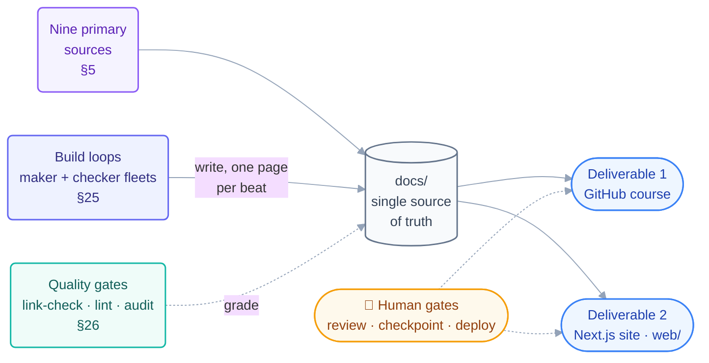

# Loop Engineering — Master Plan & Production Specification

**A complete, production-ready learning system for Loop Engineering, shipped as a GitHub-browsable markdown repository and a custom Next.js website, built from nine primary sources in a four-day delivery window.**

| | |
| --- | --- |
| **Document type** | Master plan / build specification (single source of truth) |
| **Version** | 2.0 |
| **Last updated** | 2026-07-15 |
| **Deliverables** | (1) GitHub markdown course repo · (2) Custom Next.js website (`web/`) |
| **Source of truth** | `docs/` markdown — consumed by both surfaces |
| **Delivery target** | 4 days to production-ready (3-day compressed option noted) |
| **License** | MIT (matches and attributes reference material) |

**The plan at a glance** — one content source, two surfaces, four days:



---

## Table of Contents

**Part I — Vision & Scope**

1. [Executive summary](#1-executive-summary)
2. [Goals and non-goals](#2-goals-and-non-goals)
3. [The two deliverables](#3-the-two-deliverables)
4. [Audience and learning outcomes](#4-audience-and-learning-outcomes)

**Part II — Source Material**
5. [The nine primary sources](#5-the-nine-primary-sources)

**Part III — Body of Knowledge (what the course teaches)**
6. [What Loop Engineering is](#6-what-loop-engineering-is)
7. [The four layers and the two loops](#7-the-four-layers-and-the-two-loops)
8. [The six parts of a loop](#8-the-six-parts-of-a-loop)
9. [The loop stacks (LangChain 4-loop, Ng 3-loop)](#9-the-loop-stacks)

**Part IV — Course Design**
10. [Pedagogy and page template](#10-pedagogy-and-page-template)
11. [The 14-step roadmap (detailed)](#11-the-14-step-roadmap-detailed)
12. [The "build your own loop" method](#12-the-build-your-own-loop-method)
13. [Anti-patterns and failure modes](#13-anti-patterns-and-failure-modes)
14. [When your loop fails: the recovery playbook](#14-when-your-loop-fails-the-recovery-playbook)

**Part V — The Prebuilt Loop Library**
15. [Prebuilt custom-loop catalog](#15-prebuilt-custom-loop-catalog)
16. [Starter-kit anatomy and tool matrix](#16-starter-kit-anatomy-and-tool-matrix)
17. [Loop tooling and the Loop Ready score](#17-loop-tooling-and-the-loop-ready-score)

**Part VI — Practice & Reference**
18. [Practice projects and drills](#18-practice-projects-and-drills)
19. [The Routines appendix](#19-the-routines-appendix)
20. [Glossary and reference docs](#20-glossary-and-reference-docs)

**Part VII — Engineering**
21. [Repository architecture (full)](#21-repository-architecture-full)
22. [Website architecture](#22-website-architecture)
23. [Component inventory](#23-component-inventory)
24. [Technology stack and skills.sh](#24-technology-stack-and-skillssh)

**Part VIII — Delivery**
25. [The four-day production plan](#25-the-four-day-production-plan)
26. [Quality gates and CI](#26-quality-gates-and-ci)
27. [Production-readiness definition of done](#27-production-readiness-definition-of-done)

---

# Part I — Vision & Scope

## 1. Executive summary

Loop Engineering is the emerging practice of **designing the system that prompts AI agents**, rather than prompting them by hand. This project packages the entire discipline — concepts, mechanics, a large library of ready-to-run loops, practice, and safety guidance — into a single authoritative resource that serves two audiences at once:

- **Readers on GitHub** get a complete, clickable markdown course and a folder of clone-and-run starter kits, in the spirit of the `cobusgreyling/loop-engineering` reference repo.
- **Learners on the web** get a polished, interactive course (the same content, enriched with diagrams, dual-tool code tabs, quizzes, and a live starter-kit browser).

The content is written **once** in `docs/` and rendered by both surfaces, so they never diverge. The whole thing is engineered to reach **production quality in four days** through a content-first sequence and disciplined reuse of MIT-licensed material.

## 2. Goals and non-goals

**Goals**

- Teach Loop Engineering from zero to advanced, faithfully to the nine sources.
- Ship a repo whose *material completeness* matches the reference repo (docs, per-tool examples, tools, patterns, starters, templates, stories, resources).
- Provide a **large library of prebuilt custom loops** across categories and tools, each production-shaped (success condition, limit, isolation, checker, spine, human gate, logging).
- Deliver a beautiful, fast, accessible website on top of the same content.
- Be honest about mechanics that change weekly; frame commands as pointers to live docs.

**Non-goals**

- We do not fork or republish the reference repo wholesale; we author our own course and adapt only MIT files with attribution.
- We do not maintain the `loop-*` CLIs as new software; we document them and show usage.
- We do not target every tool for every loop in v1 (see the tool-coverage policy in §16).

## 3. The two deliverables

**Deliverable 1 — GitHub markdown course (repo root).**
A `README.md` landing page (hero, badges, navigation, quickstart), a `docs/` course tree, and real `patterns/`, `starters/`, `skills/`, `templates/`, `examples/`, `stories/`, `resources/` folders. Fully readable on GitHub with mermaid diagrams and relative links — no build step.

**Deliverable 2 — Custom website (`web/`).**
A Next.js (App Router) site that renders `docs/` as an interactive course: sidebar navigation, reading progress, light/dark themes, animated diagrams, dual-tool code tabs, self-check quizzes, hands-on exercises, an interactive prebuilt-loop browser, and the Loop Ready checklist.

**The invariant:** `docs/` markdown is the single source of truth. Both surfaces read from it.

## 4. Audience and learning outcomes

**Primary audience.** Developers already comfortable with an AI coding agent (Claude Code, OpenCode, Codex, Grok, Cursor, Windsurf) who want to graduate from operating an agent to engineering autonomous loops. **Secondary audience.** Technical leads evaluating loops for a team; non-coding professionals who will use the concepts with document-based tools.

**On completion, a learner can:**

1. Explain the prompting → looping shift and where human value moves (intent, accountability).
2. Name and apply the six parts of a loop.
3. Select the correct heartbeat for a task and write a provable stopping condition.
4. Separate maker from checker and keep durable state (the spine).
5. Scaffold, audit, and run a real loop from a prebuilt kit.
6. Recognize and avoid the full catalog of anti-patterns and failure modes — and run the recovery playbook when a loop fails anyway.
7. Operate loops safely: manage token cost, verify output, and prevent comprehension debt.

---

# Part II — Source Material

## 5. The nine primary sources

| # | Source | Provenance | Role |
| --- | -------- | ----------- | ------ |
| 1 | **Panaversity — Loop Engineering: A Crash Course** | agentfactory.panaversity.org | Backbone: 15 concepts / 6 parts / 8 projects / Routines appendix |
| 2 | **Panaversity — Agentic Coding Crash Course** | companion chapter | The primitives loops are built from (plan mode, permissions, context, rules file, skills, hooks, subagents, MCP) |
| 3 | **Panaversity — Spec-Driven Development** | companion chapter | Why stopping conditions work: vibe-vs-spec, the constitution, the 4-phase method |
| 4 | **Panaversity — Scheduled Tasks: The Loop Skill & Cron Tools** | companion chapter | Heartbeat depth: `/loop`, interval syntax, `Cron*` tools, limits, jitter, troubleshooting |
| 5 | **Addy Osmani — Loop Engineering** | addyosmani.com | The named pattern; five parts + memory; "stay the engineer" |
| 6 | **LangChain — The Art of Loop Engineering** | Sydney Runkle | The 4-loop stack (agent → verification → event → hill-climbing); "loopcraft" |
| 7 | **cobusgreyling/loop-engineering** | GitHub, MIT | Starter kits, 7 patterns, scaffolding files, `loop-*` tools, Loop Ready score, per-tool examples, stories |
| 8 | **Steinberger / Cherny statements** | The New Stack, Business Insider, X | Origin quotes that motivate the practice |
| 9 | **Ng (3 nested loops) & Karpathy (success criteria)** | X | The human's context advantage; feedback loops at minutes/hours/days |

Full attribution lives in `resources/sources.md` and the website Sources page. All nine were analyzed in full during planning; working notes are retained.

---

# Part III — Body of Knowledge

> This part is the substantive content the course teaches. It is the authoritative outline every `docs/` page is written against.

## 6. What Loop Engineering is

For roughly two years, using a coding agent meant holding the tool one turn at a time: write a prompt, read the result, type the next thing. Loop Engineering replaces *the operator* with a small system that finds the work, hands it out, checks it, records what happened, and decides what is next — prompting the agent on your behalf. You design it once; it runs on its own.

The human's value does not vanish; it concentrates at the two ends a loop cannot own:

- **Intent** — stating what you want precisely enough that the result can be *checked*.
- **Accountability** — standing behind what ships.

## 7. The four layers and the two loops

**Four engineering layers**, each wrapping the previous and preventing a distinct failure:

1. **Prompt** — the words you send.
2. **Context** — everything the model sees in one turn.
3. **Harness** — the code around the model (tool execution, error handling). *The inner loop lives here.*
4. **Loop** — the outer cycle: what the system works on, when it starts, how it knows it is done.

**Two loops share the name.** The **small/inner loop** is the agent's own `context → tool calls → results → repeat` cycle; its only native stop is the model's self-assessment (the source of confident-but-wrong "Done!" endings). The **big/outer loop** — this course — is the manager around it: it chooses the task, the timing, the grading, and the memory. One inner-loop run is **one beat** of the outer loop.

## 8. The six parts of a loop

| Part | Metaphor | Job in the loop |
| ------ | ---------- | ----------------- |
| Heartbeat | starts the beat | schedule or event that fires each run |
| Worktree | — | isolation so parallel agents do not collide |
| Skill | — | project knowledge written once, read each run |
| Sub-agents | — | maker–checker split (writer ≠ grader) |
| Connector (MCP) | hands | lets the loop act, not just suggest |
| State / memory | the **spine** | durable disk state so runs compound |

## 9. The loop stacks

**LangChain's 4-loop stack** (where value compounds): agent loop → verification loop (grader/rubric) → event-driven loop (cron/webhook/message) → hill-climbing loop (trace analysis rewrites the harness).

**Ng's 3 nested loops** (where the human sits): coding loop (minutes) ⊂ feedback loop (hours) ⊂ outside-world loop (days). The fast loop self-runs; the slow ones need the human's **context advantage**.

---

# Part IV — Course Design

## 10. Pedagogy and page template

Every concept page follows one repeatable structure so ideas land and transfer:

1. **Hook** — a concrete scenario.
2. **Plain-English explanation** — one idea at a time; body metaphor where the source uses one.
3. **Diagram** — mermaid (GitHub) upgraded to animated SVG (site).
4. **Dual-tool code tabs** — Claude Code ↔ OpenCode (plus Codex/Grok where relevant).
5. **Going-deeper callout** — optional depth from companion chapters.
6. **Check yourself** — one-question quiz with a revealed answer.
7. **Try With AI** — a hands-on exercise in a throwaway repo.
8. **When it goes wrong** — symptom → cause → fix.
9. **Glossary popovers** — inline definitions.

**Two reading paths:** a ~2–3h **core path** (Steps 1–13 + Projects 1–3) and a **second read** (going-deeper notes, Step 14, Projects 4–8, the appendix). **Lasting vs mechanical layer** is taught explicitly: memorize the shape; look up the commands.

### 10.1 Skill tracks — from beginner to ultra-pro

The system is a **graded curriculum**, not a flat set of pages. Four tracks take a learner from never-having-built-a-loop to designing and governing loop *fleets*. Each track has an entry check, a body of study, hands-on labs, and an exit assessment; you graduate a track by *building*, not by reading.

| Track | Level | You start knowing… | You finish able to… | Covers |
| ------- | ------- | -------------------- | -------------------- | -------- |
| **T1 · Foundations** | Beginner | how to use an AI coding agent by hand | explain the shift and the six parts; run your first in-session loop | Prerequisites, Foundations, Part 1, Projects 1 |
| **T2 · Practitioner** | Intermediate | the six parts | choose a heartbeat, write a provable stop, split maker/checker, keep a spine | Parts 2–4, Projects 2–4, the method |
| **T3 · Engineer** | Advanced | how to assemble a loop | build the full six-part loop in two tools, pick from the prebuilt library, operate it safely | Parts 5–6, the loop library, Projects 5–8, operating/safety |
| **T4 · Ultra-Pro** | Expert | how to ship one loop | design hill-climbing loops, coordinate multi-loop fleets, govern permissions at team scale, author and contribute new loops | `advanced/`, multi-loop, enterprise, governance, certification capstone |

**Progression aids baked into the repo:** a `start-here.md` router, a `learning-tracks.md` map, per-part quizzes, per-part flashcards, graded labs with reference solutions, cheatsheets per tool, and a final **Loop Ready certification** capstone with a rubric. The website surfaces the active track, a progress bar, and "you are here" on the roadmap.

## 11. The 14-step roadmap (detailed)

Each step is one `docs/` page with *what it teaches*, *key mechanics*, and *sources*.

### Part 1 — The Shift

- **Step 1 · From Prompting to Looping** — the shift; intent & accountability; the prompting-vs-looping table. *(S1, S5, S8)*
- **Step 2 · The Four Layers** — prompt→context→harness→loop; small vs big loop with the `while True` inner-loop code. *(S1, S6)*
- **Step 3 · Anatomy of a Loop** — the six parts, metaphors, and the finish-line pseudo-code; "it's not only for code." *(S1, S2, S5)*

### Part 2 — The Heartbeat

- **Step 4 · In-session loops** — `/loop`; interval syntax; `CronCreate/List/Delete`; 50-task cap, 3-day expiry, jitter, no catch-up; `CLAUDE_CODE_DISABLE_CRON`; OpenCode shell timer + `serve --attach`. *(S1, S4)*
- **Step 5 · Conditional / run-until-done** — `/goal`; transcript-reading checker; three stops (success, limit, no-progress); the Ralph loop; doom loop; `MAX_RETRIES`/`RETRY_WATCHDOG`; OpenCode capped `for` + `steps`. Stopping condition = spec. *(S1, S3, S4)*
- **Step 6 · Unattended schedules** — Routines (four parts: prompt, repos, connectors, trigger); daily caps; `claude/` guardrail; `claude -p` cron; Desktop tasks; OpenCode via cron/GitHub Actions. *(S1, S4, S7)*
- **Step 7 · Event-driven** — GitHub triggers (PR/release; `synchronize`), Channels (running session + security caution), API `/fire`; dropped-not-queued caps → reconciliation sweep; `opencode github install`. *(S1, S4)*

### Part 3 — The Body

- **Step 8 · Worktrees** — isolation; `--worktree`, `isolation: worktree`; `git worktree add`. *(S1, S2)*
- **Step 9 · Skills** — cold-start problem; `SKILL.md`; tiny loop prompts; skill vs plugin. *(S1, S2)*
- **Step 10 · Connectors (MCP)** — act vs talk; three connector rules (few focused tools, idempotent writes, actionable errors). *(S1, S2)*
- **Step 11 · Maker–Checker** — writer ≠ grader; LLM-as-judge; cheaper read-only checker; the dynamic-workflows interlude (a workflow is the body of one beat). *(S1, S2, S6)*

### Part 4 — The Spine

- **Step 12 · State between runs** — model forgets; rules file + progress file; the intern's-diary metaphor; the spine as record; the hill-climbing "loop that improves the loop"; self-learning vs self-improving. *(S1, S2, S6)*

### Part 5 — A Complete Loop, Twice

- **Step 13 · Build the morning-triage loop** — all six parts joined; the shared `daily-triage/SKILL.md`, the `reviewer` agent (both tools), the Routine prompt, and the GitHub Actions workflow; the 7-item minimum-safe checklist; "one real morning." *(S1)*

### Part 6 — Human Control

- **Step 14 · Staying the Engineer** — token cost, verification, comprehension debt; the three nested loops; org-scale concerns; observability ("green ≠ done"); prove-before-overnight; AI gravity. *(S1, S5, S9)*

## 12. The "build your own loop" method

A dedicated page and recurring thread: **A** pick the task and its shape (ends → conditional; repeats → schedule/event; once → no loop) · **B** write the stopping condition as a spec · **C** assemble the six parts · **D** add the three stops and guardrails · **E** prove it, then let go (report → assisted → unattended) · **F** improve the loop, not just the work.

## 13. Anti-patterns and failure modes

A first-class page plus inline "When it goes wrong" boxes, drawn from `anti-patterns.md`, `failure-modes.md`, and the essays.

**Design:** no spending limit · no stuck-check · maker grades itself · vague stopping condition · prompting instead of looping maintenance · fat prompt / bloated rules file · too many overlapping tools · non-idempotent writes · silent errors · reaching for the biggest loop · a workflow mistaken for a loop · too-strict constitution.

**Operational:** doom loop · no spine · green ≠ done · task didn't fire (session scope) · didn't survive restart · retrying webhook = runaway heartbeat · secrets in `.env` · events dropped not queued · unrestricted branch pushes on.

**Human/judgment:** cognitive surrender · comprehension debt · intent debt · AI gravity · same-loop-opposite-results.

## 14. When your loop fails: the recovery playbook

§13 teaches learners to *spot* a failure; this page gives a short, fixed sequence for what to *do* when a loop has already failed:

1. **Stop the loop first.** Pause the schedule or trigger before anything else — never debug a loop that is still running.
2. **Save the evidence.** Copy the state file and run log as they are, and set aside any unverified output (close the PR, hold the message).
3. **Find the real cause.** Replay the last run, see where the recorded state stopped matching reality, and fix the layer that actually broke — not just the symptom.
4. **Fix the loop, not just the output.** Hand-patching the result leaves the same failure scheduled to repeat; strengthen the part that failed (stop condition, checker, limit, or gate) and note the fix in the state file.
5. **Earn trust back.** Drop the loop one autonomy level, watch one full real run succeed, then turn the schedule back on.

**Why this matters:** a fixed playbook turns a scary failure into a calm routine — no panic, no guesswork, no repeat of the same mistake. Every recovery ends with the loop *stronger* than before, and the write-up becomes course material (a `stories/` entry).

**Source verification.** The five steps mirror established incident-response practice, step for step: Google SRE's "mitigate first, then diagnose" (step 1), automatic timeline/evidence capture (step 2), root-cause over symptom analysis (step 3), corrective action items that fix the *class* of failure — mitigative *and* preventative (step 4), and the blameless postmortem filed to a shared repository (the `stories/` entry). Step 5's "drop one autonomy level, watch one real run" matches the reference repo's own rule to run every pattern in L1 report-only mode before enabling fixes, and LangChain's human-in-the-loop touchpoints per loop layer. *(Google SRE Book — Incident Management & Postmortem Culture; S6; S7.)*

---

# Part V — The Prebuilt Loop Library

> This is the "all types of custom loop, prebuilt" requirement. The library is a catalog of ready-to-run loops, each production-shaped, browsable on GitHub and in an interactive picker on the site.

## 15. Prebuilt custom-loop catalog

Loops are grouped by job. Each entry ships with a `LOOP.md`, a `README.md`, a state (spine) example, one or more `SKILL.md` files, a `loop-verifier` agent, and per-tool config. Every loop declares: **heartbeat type · cadence · week-1 level (L1 report / L2 assisted / L3 unattended) · token cost · human-gate placement.**

**A. Repository maintenance**

| Loop | Heartbeat | Cadence | L | Cost |
| ------ | ----------- | --------- | --- | ------ |
| daily-triage | schedule | 1d–2h | L1 | Low |
| ci-sweeper | schedule/event | 5–15m | L2 | Very high |
| dependency-sweeper | schedule | 6h–1d | L2 | Medium |
| post-merge-cleanup | schedule | 1d–6h | L1 | Low |
| lint-sweep | schedule | 1d | L1 | Low |
| flaky-test-fixer | conditional | on-demand | L2 | High |
| dead-code-sweeper | schedule | weekly | L1 | Low |

**B. Pull-request & review**

| Loop | Heartbeat | Cadence | L | Cost |
| ------ | ----------- | --------- | --- | ------ |
| pr-babysitter | schedule | 5–15m | L1 | High |
| pr-reviewer | event (PR) | per PR | L1 | Medium |
| auto-changelog-on-merge | event (merge) | per merge | L1 | Low |

**C. Release**

| Loop | Heartbeat | Cadence | L | Cost |
| ------ | ----------- | --------- | --- | ------ |
| changelog-drafter | schedule/tag | 1d or tag | L1 | Low |
| release-notes-drafter | event (release) | per release | L1 | Low |
| version-bump | conditional | on-demand | L2 | Low |

**D. Issue & intake**

| Loop | Heartbeat | Cadence | L | Cost |
| ------ | ----------- | --------- | --- | ------ |
| issue-triage | schedule | 2h–1d | L1 | Low |
| stale-issue-closer | schedule | weekly | L1 | Low |
| bug-reproducer | conditional | on-demand | L2 | High |

**E. Documentation**

| Loop | Heartbeat | Cadence | L | Cost |
| ------ | ----------- | --------- | --- | ------ |
| docs-freshness-check | schedule | daily | L1 | Low |
| broken-link-sweep | schedule | daily | L1 | Low |
| readme-sync | event (push) | per push | L1 | Low |
| api-docs-drafter | conditional | on-demand | L2 | Medium |

**F. Security**

| Loop | Heartbeat | Cadence | L | Cost |
|------|-----------|---------|---|------|
| secret-scan | event/schedule | per push / daily | L1 | Low |
| security-advisory-triage | schedule | daily | L2 | Medium |

**G. Reporting & knowledge**

| Loop | Heartbeat | Cadence | L | Cost |
| ------ | ----------- | --------- | --- | ------ |
| whats-changed-weekly | schedule | weekly | L1 | Low |
| stakeholder-brief | schedule | weekly | L1 | Low |
| competitor-changelog-watcher | schedule | daily | L1 | Low |
| standup-summary | schedule | weekday | L1 | Low |

**H. Support (human-gated)**

| Loop | Heartbeat | Cadence | L | Cost |
|------|-----------|---------|---|------|
| support-reply-drafter | event (message) | per ticket | L1 | Medium |

**I. Self-improvement (hill-climbing)**

| Loop | Heartbeat | Cadence | L | Cost |
|------|-----------|---------|---|------|
| rules-file-improver | schedule | weekly | L1 | Low |
| trace-analyzer | schedule | weekly | L2 | Medium |

> **Grounding note (categories J–Q).** These eight categories are original to this course — no official source enumerates these specific loops. What *is* source-verified is (a) the concept each category applies, cited per category below, and (b) the entry format every loop follows — heartbeat · cadence · week-1 level · cost — which comes from the reference repo's pattern registry (S7), including its rule that every loop starts in **L1 report-only mode** before fixes are enabled.

**J. Testing & quality assurance**
*Applies: LangChain's verification loop — a grader checks output against a rubric and sends failures back as feedback (S6); Anthropic's early-victory rule — a checker must run the complete test suite before marking work as passed (When to use multi-agent systems).*

| Loop | Heartbeat | Cadence | L | Cost |
| ------ | ----------- | --------- | --- | ------ |
| test-coverage-improver | conditional | on-demand | L2 | High |
| e2e-smoke-runner | event (deploy) / schedule | per deploy / daily | L1 | Medium |
| snapshot-updater | conditional | on-demand | L2 | Low |
| mutation-test-triage | schedule | weekly | L2 | Medium |

**K. Infrastructure & DevOps**
*Applies: LangChain's event-driven loop — a schedule or webhook connects the agent to your ecosystem (S6); S7's drift-detection concept (`loop-sync`), extended from loop state to infrastructure state.*

| Loop | Heartbeat | Cadence | L | Cost |
| ------ | ----------- | --------- | --- | ------ |
| iac-drift-detector | schedule | 6h–1d | L1 | Medium |
| container-image-updater | schedule | weekly | L2 | Medium |
| env-config-drift-check | schedule | daily | L1 | Low |
| cloud-cost-watcher | schedule | daily | L1 | Low |

**L. Monitoring & incident response**
*Applies: the event-driven loop — "an event fires … and the agent runs" (S6); Google SRE incident practice — mitigate first, capture the evidence timeline — for alert-triage and incident-timeline-drafter (SRE Book, Incident Management).*

| Loop | Heartbeat | Cadence | L | Cost |
| ------ | ----------- | --------- | --- | ------ |
| error-log-clusterer | schedule | 1–6h | L1 | Medium |
| alert-triage | event (alert) | per alert | L1 | Medium |
| incident-timeline-drafter | conditional | on-demand | L1 | Low |
| uptime-prober | schedule | 5–15m | L1 | Low |

**M. Data & database**
*Applies: the spine — durable state that runs compound on (S1, S5) — and S7's drift detection, pointed at schemas and data instead of loop state.*

| Loop | Heartbeat | Cadence | L | Cost |
| ------ | ----------- | --------- | --- | ------ |
| migration-drift-checker | schedule | daily | L1 | Low |
| data-quality-sentinel | schedule | 6h–1d | L1 | Medium |
| schema-docs-sync | event (merge) | per migration merge | L1 | Low |

**N. Performance**
*Applies: the verification loop with a measurable rubric — budget/threshold checks on PR and deploy events (S6); maker–checker with a read-only grader (S1, S2).*

| Loop | Heartbeat | Cadence | L | Cost |
| ------ | ----------- | --------- | --- | ------ |
| bundle-size-watcher | event (PR) | per PR | L1 | Low |
| perf-regression-detector | event (deploy) / schedule | per deploy / daily | L2 | Medium |
| slow-query-hunter | schedule | weekly | L2 | Medium |

**O. Localization & content**
*Applies: "it's not only for code" (S1, S5) — the six-part loop shape on documents and strings; event-driven sync on push (S6).*

| Loop | Heartbeat | Cadence | L | Cost |
| ------ | ----------- | --------- | --- | ------ |
| i18n-string-sync | event (push) | per push | L1 | Low |
| translation-drafter | conditional | on-demand | L1 | Medium |
| content-freshness-sweep | schedule | weekly | L1 | Low |

**P. Compliance & governance**
*Applies: S7's week-1 rule — scheduled audits stay L1 report-only; human-gated review before anything ships (S6 human-in-the-loop touchpoints).*

| Loop | Heartbeat | Cadence | L | Cost |
| ------ | ----------- | --------- | --- | ------ |
| license-audit | schedule | weekly | L1 | Low |
| accessibility-audit | schedule | weekly | L1 | Medium |
| audit-log-reviewer | schedule | daily | L1 | Low |

**Q. Personal & team productivity (non-coding)**
*Applies: the non-coding loop (S1); S6's event-driven example — "a new document lands … and the agent runs"; a human gate on all outbound communication (S6).*

| Loop | Heartbeat | Cadence | L | Cost |
| ------ | ----------- | --------- | --- | ------ |
| inbox-triage | schedule | 1–2h | L1 | Low |
| calendar-brief | schedule | weekday | L1 | Low |
| meeting-notes-distiller | event (recording) | per meeting | L1 | Low |

**R. Multi-loop coordination & fleet orchestration (T4 — loops that manage other loops)**

> **Source-verified.** Unlike J–Q (original categories grounded in source *concepts* — see the grounding note above), every entry here traces to a named *mechanism* in an official source: the reference repo's `docs/multi-loop.md` (S7, MIT), Anthropic's *Building Effective Agents* / *How we built our multi-agent research system* / *When to use multi-agent systems*, and LangChain's *The Art of Loop Engineering* (S6). Citation per loop below.

| Loop | Heartbeat | Cadence | L | Cost | Verified by |
| ------ | ----------- | --------- | --- | ------ | ------------- |
| fleet-orchestrator | schedule | 1–6h | L1 | High | Anthropic orchestrator-workers pattern (*Building Effective Agents*; lead-agent + subagents in the multi-agent research system) |
| loop-collision-sentinel | schedule | 5–15m | L1 | Low | S7 `multi-loop.md`: `acting_on:` collision detection + "one owner per branch" rule |
| fleet-budget-governor | schedule | 1h–1d | L2 | Low | S7 `multi-loop.md` aggregate token budget; Anthropic's finding that multi-agent systems burn ~15× the tokens of chat |
| fleet-health-watchdog | schedule | 15m–1h | L1 | Low | S7 `multi-loop.md` shared `loop-run-log.md` observability; Anthropic's "early victory problem" (verify with concrete criteria, don't trust a loop's own "done") |
| cross-loop-state-reconciler | schedule | 1–6h | L1 | Low | S7 `loop-sync` tool (STATE↔LOOP drift detection), applied fleet-wide; LangChain: hill-climbing quality "depends on the integrity of every past write" |
| human-inbox-escalator | schedule | 1–2h | L1 | Low | S7 `multi-loop.md` "Human Inbox (ambiguous / cross-loop)" escalation section; LangChain human-in-the-loop touchpoints per loop layer |

**The coordination contract (from S7 `docs/multi-loop.md`, enforced by every R loop):**

1. **One owner per branch** — at most one loop may mutate a branch per hour; each loop writes `acting_on:` to its state file and skips (logging the skip) if another loop holds the target.
2. **Separate state files by function** — `STATE.md` for triage priorities, one `<loop>-state.md` per action loop, a shared `loop-run-log.md` for observability.
3. **Triage never competes with action** — report loops (L1) and action loops (L2+) run on independent schedules; priority order when they conflict: ci-sweeper > pr-babysitter > dependency-sweeper > post-merge-cleanup > daily-triage ("red main blocks everything").
4. **Shared denylist** — the same path denylist is copied into every `LOOP.md` in the fleet.
5. **Aggregate token budget** — spend is tracked across the fleet, not per loop; the budget governor pauses lowest-priority loops first.

R loops are **meta-loops**: their "work" is reading other loops' spines and run logs, never the codebase itself — which keeps them cheap, read-mostly, and safe at L1. They ship as extended kits (Claude Code + OpenCode) tied to the T4 pages `operating/multi-loop.md` and `advanced/multi-loop-coordination.md`.

Each loop page cross-links to the concepts it exercises and the anti-patterns it must avoid. The **core set** carries the deepest treatment and full multi-tool kits: the original seven (daily-triage, pr-babysitter, ci-sweeper, dependency-sweeper, changelog-drafter, post-merge-cleanup, issue-triage) **plus all 27 loops in categories J–Q** — 34 core loops in total. The remaining loops in categories A–I, and the six category-R fleet loops, ship for the primary tools with a documented porting path.

## 16. Starter-kit anatomy and tool matrix

**Every kit's shape** (what `loop-init` scaffolds):

```
<loop-name>/
├── LOOP.md                         # what this loop does, its stops, its gate
├── README.md                       # quickstart + Loop Ready notes
├── <loop-name>-state.md.example    # the spine
├── loop-budget.md · loop-constraints.md · loop-run-log.md
├── .claude/  (skills/<x>/SKILL.md, agents/loop-verifier.md)
├── .codex/   (skills + agents/verifier.toml)
├── .grok/    (skills/…)
└── opencode.json.example + skills/  (OpenCode variant)
```

**Tool coverage policy (honest scoping for the 4-day window).** Tools mirror the reference repo's `examples/`: **Claude Code, OpenCode, Codex, Grok, Cursor, Windsurf, GitHub Actions, Hermes, OpenClaw, MCP**.

- **Core loops (34 — the original 7 plus all of categories J–Q):** full kits for Claude Code, OpenCode, Codex, Grok + GitHub Actions.
- **Extended loops (the remaining A–I entries and category R):** Claude Code + OpenCode kits, plus a per-tool `examples/` snippet and a documented porting path for the rest. R kits additionally ship the shared coordination contract (denylist block, `acting_on:` state convention, fleet budget file).
- Every loop, whatever its coverage, is validated against the Loop Ready checklist.

## 17. Loop tooling and the Loop Ready score

Documented (not re-implemented), with real usage and links:

| Tool | Purpose |
| ------ | --------- |
| `loop-init` | scaffold skills/state/budget/constraints; print the Loop Ready score |
| `loop-audit` | the Loop Readiness Score CLI (`--suggest`, `--badge`) |
| `loop-cost` | token-spend estimator |
| `loop-sync` | drift detection between `STATE.md` and `LOOP.md` |
| `loop-context` | stateful memory manager + circuit breaker for long runs |
| `loop-worktree` | isolated git worktrees per fix attempt |
| `loop-mcp-server` | MCP runtime lookup for patterns/skills/state |
| `goal-audit` | audit `/goal`-style run-until-done conditions |

**Loop Ready checklist** (interactive on the site): success condition · limit · isolated branch/worktree · read-only checker · state file · human gate · a log/notification.

---

# Part VI — Practice & Reference

## 18. Practice projects and drills

Eight projects (easy → capstone) plus three routine drills, each a `docs/projects/*.md` page rendered as a card (difficulty, time, concepts, "done when"). Banner on every project: **throwaway repo** and **set a limit first**.

1. A watch loop · 2. Make the tests pass, then stop · 3. The morning brief with a memory · 4. A fix loop with a real checker · 5. Codify the body · 6. The doorbell loop · 7. Break it on purpose · 8. Your own daily loop (capstone). **Drills 9–11:** rehearse a routine for free · the secrets drill · the two-routine gate.

## 19. The Routines appendix

`docs/appendix/routines.md`, A1–A6: local vs cloud · the creation form field-by-field · the three triggers · secrets/state/identity · reading the runs (green ≠ done) · the routine safety checklist.

## 20. Glossary and reference docs

Mirroring the reference repo's `docs/`: `glossary` · `concepts.md` (intent debt, comprehension debt, harness vs loop) · `primitives.md` + `primitives-matrix.md` (cross-tool mapping) · `pattern-picker.md` · `loop-design-checklist.md` · `safety.md` · `operating-loops.md` · `multi-loop.md` · `failure-modes.md`.

---

# Part VII — Engineering

## 21. Repository architecture (full)

A complete, graded learning system. Content lives at the repo root as GitHub-browsable markdown (the source of truth); the website is isolated in `web/`. The tree below is enumerated to file level so the build has no ambiguity.

```
LoopEngineering-CrashCourse/
│
├── README.md                         # hero, badges, nav, quickstart, "start here" router
├── LICENSE                           # MIT
├── loop-plan.md                      # THIS master plan
├── CONTRIBUTING.md                   # contribution ladder + how to add a loop
├── SECURITY.md
├── CODEOWNERS
├── CITATION.cff
├── AGENTS.md                         # the repo's OWN rules file (dogfooding)
├── CLAUDE.md                         # rules file for Claude Code (dogfooding)
├── LOOP.md                           # the loops that maintain this repo (dogfooding)
├── STATE.md                          # the spine of this repo's own loops
├── loop-budget.md
├── loop-constraints.md
├── loop-run-log.md
│
├── .github/
│   ├── workflows/
│   │   ├── link-check.yml
│   │   ├── registry-validate.yml
│   │   ├── loop-ready-audit.yml
│   │   ├── web-build.yml
│   │   ├── markdown-lint.yml
│   │   └── deploy-pages.yml
│   ├── ISSUE_TEMPLATE/
│   │   ├── bug.md
│   │   ├── new-loop.md
│   │   ├── content-fix.md
│   │   └── question.md
│   ├── PULL_REQUEST_TEMPLATE.md
│   ├── dependabot.yml
│   └── FUNDING.yml
│
├── docs/                             # ── THE COURSE (single source of truth) ──
│   ├── README.md                     # course index: the 4 tracks + 14-step roadmap
│   ├── start-here.md                 # 60-second router: which track am I?
│   ├── learning-tracks.md            # T1→T4 map, entry checks, exit assessments
│   │
│   ├── prerequisites/
│   │   ├── README.md
│   │   ├── environment-setup.md      # install Claude Code / OpenCode / Codex / Grok
│   │   ├── agentic-coding-primer.md  # plan mode, permissions, context, rules file, subagents, MCP
│   │   └── spec-driven-primer.md     # vibe-vs-spec, the constitution, the 4-phase method
│   │
│   ├── 00-foundations/
│   │   ├── glossary.md
│   │   ├── mental-models.md
│   │   ├── concepts.md               # intent debt, comprehension debt, harness vs loop
│   │   ├── the-four-layers.md
│   │   ├── primitives.md
│   │   └── primitives-matrix.md      # cross-tool mapping
│   │
│   ├── part-1-the-shift/
│   │   ├── README.md
│   │   ├── 01-from-prompting-to-looping.md
│   │   ├── 02-the-four-layers.md
│   │   ├── 03-anatomy-of-a-loop.md
│   │   ├── quiz.md
│   │   └── flashcards.md
│   ├── part-2-heartbeat/
│   │   ├── README.md
│   │   ├── 04-in-session-loops.md
│   │   ├── 05-conditional-run-until-done.md
│   │   ├── 06-unattended-schedules.md
│   │   ├── 07-event-driven.md
│   │   ├── quiz.md
│   │   └── flashcards.md
│   ├── part-3-the-body/
│   │   ├── README.md
│   │   ├── 08-worktrees.md
│   │   ├── 09-skills.md
│   │   ├── 10-connectors-mcp.md
│   │   ├── 11-maker-checker.md
│   │   ├── quiz.md
│   │   └── flashcards.md
│   ├── part-4-the-spine/
│   │   ├── README.md
│   │   ├── 12-state-between-runs.md
│   │   ├── quiz.md
│   │   └── flashcards.md
│   ├── part-5-complete-loop/
│   │   ├── README.md
│   │   ├── 13-build-the-loop-twice.md
│   │   ├── 13a-claude-code-walkthrough.md
│   │   ├── 13b-opencode-walkthrough.md
│   │   └── quiz.md
│   ├── part-6-human-control/
│   │   ├── README.md
│   │   ├── 14-staying-the-engineer.md
│   │   ├── cost-management.md
│   │   ├── verification.md
│   │   ├── the-three-nested-loops.md
│   │   ├── quiz.md
│   │   └── flashcards.md
│   │
│   ├── methods/
│   │   ├── make-your-own-loop.md     # the A–F method
│   │   ├── loop-design-checklist.md
│   │   ├── pattern-picker.md
│   │   └── decision-framework.md
│   ├── operating/
│   │   ├── operating-loops.md
│   │   ├── safety.md
│   │   ├── observability.md
│   │   ├── failure-modes.md
│   │   ├── anti-patterns.md
│   │   ├── recovery-playbook.md
│   │   └── multi-loop.md
│   ├── advanced/                     # ── ULTRA-PRO track (T4) ──
│   │   ├── hill-climbing-loops.md
│   │   ├── loopcraft-stacking-loops.md
│   │   ├── evals-and-traces.md
│   │   ├── multi-loop-coordination.md
│   │   ├── loops-at-enterprise-scale.md
│   │   ├── governance-and-permissions.md
│   │   └── authoring-your-own-loop.md
│   │
│   ├── projects/                     # graded labs
│   │   ├── README.md
│   │   ├── 01-watch-loop.md
│   │   ├── 02-make-the-tests-pass.md
│   │   ├── 03-morning-brief-with-memory.md
│   │   ├── 04-fix-loop-with-a-checker.md
│   │   ├── 05-codify-the-body.md
│   │   ├── 06-the-doorbell-loop.md
│   │   ├── 07-break-it-on-purpose.md
│   │   ├── 08-your-own-daily-loop.md
│   │   ├── drills/
│   │   │   ├── 09-rehearse-a-routine.md
│   │   │   ├── 10-secrets-drill.md
│   │   │   └── 11-two-routine-gate.md
│   │   └── solutions/                # reference solutions for each lab + drill
│   │
│   ├── appendix/
│   │   ├── routines.md               # A1–A6
│   │   ├── further-reading.md
│   │   └── cheatsheets/
│   │       ├── claude-code.md
│   │       ├── opencode.md
│   │       ├── codex.md
│   │       ├── grok.md
│   │       ├── cron.md
│   │       └── mcp.md
│   │
│   └── assessments/
│       ├── final-exam.md
│       ├── capstone-rubric.md
│       └── loop-ready-certification.md
│
├── patterns/                         # loop specs + machine-readable registry
│   ├── README.md
│   ├── registry.yaml
│   ├── registry.schema.json
│   ├── pattern-template.md
│   └── <one .md per prebuilt loop>   # ~62 loop specs across categories A–R (Part V)
│
├── starters/                         # ── PREBUILT LOOP LIBRARY: clone-and-run kits ──
│   ├── README.md
│   ├── _template/                    # canonical kit skeleton (what loop-init emits)
│   ├── daily-triage/                 # CORE — full multi-tool kit (shown in full):
│   │   ├── LOOP.md
│   │   ├── README.md
│   │   ├── daily-triage-state.md.example
│   │   ├── loop-budget.md
│   │   ├── loop-constraints.md
│   │   ├── loop-run-log.md
│   │   ├── .claude/
│   │   │   ├── skills/daily-triage/SKILL.md
│   │   │   └── agents/loop-verifier.md
│   │   ├── .codex/
│   │   │   ├── skills/daily-triage/SKILL.md
│   │   │   └── agents/verifier.toml
│   │   ├── .grok/
│   │   │   └── skills/daily-triage/SKILL.md
│   │   └── opencode/
│   │       ├── opencode.json.example
│   │       └── skills/daily-triage/SKILL.md
│   ├── pr-babysitter/                # CORE (same kit shape as above)
│   ├── ci-sweeper/                   # CORE
│   ├── dependency-sweeper/           # CORE
│   ├── changelog-drafter/            # CORE
│   ├── post-merge-cleanup/           # CORE
│   ├── issue-triage/                 # CORE
│   ├── <categories J–Q>/             # CORE — all 27 loops (testing, infra, monitoring,
│   │                                 #   data, performance, localization, compliance,
│   │                                 #   productivity), full multi-tool kits
│   └── <extended loops>/             # remaining A–I entries (docs-freshness, lint-sweep,
│                                     #   secret-scan, stakeholder-brief, …) + category R
│                                     #   fleet loops (fleet-orchestrator, collision-sentinel,
│                                     #   budget-governor, watchdog, reconciler, escalator)
│                                     #   Claude Code + OpenCode kits + porting notes
│
├── skills/                           # reusable SKILL.md building blocks
│   ├── loop-triage/SKILL.md
│   ├── loop-verifier/SKILL.md
│   ├── loop-budget/SKILL.md
│   ├── loop-constraints/SKILL.md
│   └── minimal-fix/SKILL.md
│
├── templates/
│   ├── STATE.md.template
│   ├── loop-budget.md.template
│   ├── loop-constraints.md.template
│   ├── loop-run-log.md.template
│   └── SKILL.md.{triage,verifier,guard,intake,minimal-fix}
│
├── examples/                         # per-tool worked examples (10 tools)
│   ├── README.md
│   ├── claude-code/
│   ├── opencode/
│   ├── codex/
│   ├── grok/
│   ├── cursor/
│   ├── windsurf/
│   ├── github-actions/
│   ├── hermes/
│   ├── openclaw/
│   └── mcp/
│
├── stories/                          # real wins & honest failures (adapted, attributed)
│   ├── README.md
│   └── <~15 story files>             # report-only win, ci-sweeper infinite flaky test,
│                                     #   l1→l2 graduation, multi-loop collision, …
│
├── resources/
│   ├── sources.md                    # full attribution for all 9 sources
│   └── reading-trail.md
│
├── assets/
│   ├── visuals/                      # diagrams/images shared by markdown + site
│   └── og/                           # social preview images
│
├── scripts/
│   ├── link-check.mjs
│   ├── validate-registry.mjs
│   ├── loop-ready-audit.mjs
│   ├── append-run-log.mjs
│   ├── before-after-demo.sh
│   └── new-loop-scaffold.mjs
│
└── web/                              # ── THE CUSTOM WEBSITE (see §22) ──
    ├── app/                          # App Router — renders ../docs, ../starters, ../patterns
    ├── components/                   # see §23
    ├── lib/                          # content.ts, roadmap.ts, patterns.ts
    ├── mdx-components.tsx             # markdown → interactive React mapping
    ├── public/
    ├── tailwind.config.ts
    ├── next.config.mjs
    └── package.json
```

## 22. Website architecture

```
web/
├── app/
│   ├── layout.tsx                 # shell: sidebar, progress, theme toggle
│   ├── page.tsx                   # landing (mindset-shift hero + roadmap)
│   ├── tracks/page.tsx            # the 4 skill tracks (T1→T4) + entry checks
│   ├── docs/[...slug]/page.tsx    # renders any ../docs/*.md via MDX
│   ├── loops/page.tsx             # interactive prebuilt-loop browser (Part V)
│   ├── loops/[slug]/page.tsx      # a loop's kit: files + copy + tool switcher
│   ├── quiz/[part]/page.tsx       # graded per-part quizzes
│   ├── flashcards/[part]/page.tsx # spaced-repetition study aids
│   ├── projects/page.tsx · appendix/routines/page.tsx · sources/page.tsx
│   └── certification/page.tsx     # Loop Ready capstone + certificate
├── components/                    # §23
├── lib/  (content.ts, roadmap.ts, patterns.ts)   # read ../docs, ../patterns
├── mdx-components.tsx             # markdown → interactive React mapping
├── public/ · tailwind.config.ts · next.config.mjs · package.json
```

**Content-to-component mapping.** ```claude /```opencode fences → `CodeTabs`; `> [!NOTE]/[!WARNING]` → `Callout`; `<!-- check -->` → `CheckYourself`; mermaid fences → rendered diagrams. Markdown stays clean and GitHub-readable; interactivity is layered at render time.

## 23. Component inventory

`Sidebar`/`ProgressNav` · `TrackSelector` · `ProgressTracker` (per-track completion) · `ThemeToggle` · `LoopDiagram` (animated 6-part cycle) · `LayersStack` · `HeartbeatMenu` · `MakerCheckerDiagram` · `CodeTabs` · `Callout` · `CheckYourself` · `TryWithAI` · `TroubleshootBox` · `GlossaryTerm` · `Quiz` (graded, per part) · `Flashcards` (flip + spaced repetition) · `LoopBrowser` (filter by category/tool/cadence) · `StarterViewer` (file tree + copy + tool switcher) · `LoopReadyChecklist` · `ProjectCard` · `AntiPatternCard` · `CertificateGenerator` · `CostEstimator` (stretch).

## 24. Technology stack and skills.sh

**Stack:** Next.js (App Router) · TypeScript · Tailwind CSS · MDX · mermaid → self-contained SVG · deploy to Vercel/GitHub Pages.

**skills.sh skills to pull** (`npx skills add`, each verified before use): `vercel-labs/agent-skills` (Next.js/React best practices + web-design guidelines) · `anthropics/skills` (`frontend-design`, `skill-creator` for authoring the example `SKILL.md` files).

---

# Part VIII — Delivery

## 25. The four-day production plan

Content-first: `docs/` is valuable the moment it exists, so we write the course before the site. Each day ends at a shippable checkpoint. A compressed 3-day option is noted at the end.

### Day 1 — Repo foundation + tracks + prerequisites

**The complete Day 1 goal.** By the end of Day 1, the repository exists as a real, public-shape, GitHub-browsable project with its full skeleton in place and its *entry layer* fully written — everything a learner needs **before** the 14 steps begin. Concretely, the goal decomposes into four outcomes:

1. **The repo stands up as a project.** Repo initialized with MIT `LICENSE`, a complete `README.md` (hero, badges, navigation, quickstart, "start here" router), `resources/sources.md` with full attribution for all nine sources, `CONTRIBUTING.md`, `SECURITY.md`, `CODEOWNERS`, `CITATION.cff`, and `.github/` populated (the six workflows from §26 plus issue/PR templates, `dependabot.yml`).
2. **The repo dogfoods its own discipline.** The root carries the files the course teaches: `AGENTS.md`, `CLAUDE.md`, `LOOP.md` (the loops that maintain this repo), `STATE.md` (the spine), `loop-budget.md`, `loop-constraints.md`, `loop-run-log.md` — all with real content, not placeholders.
3. **The entry layer of the course is written.** `docs/start-here.md` (60-second router), `docs/learning-tracks.md` (T1–T4 map with entry checks and exit assessments), all three `prerequisites/` pages (environment setup, agentic-coding primer, spec-driven primer), and all six `00-foundations/` pages (glossary, mental-models, concepts, the-four-layers, primitives, primitives-matrix) — each following the §10 page template.
4. **The toolchain is ready for Day 2.** skills.sh skills pulled and verified (`vercel-labs/agent-skills`, `anthropics/skills`); the empty directory scaffold for `docs/part-1` … `part-6`, `patterns/`, `starters/_template/`, `skills/`, `templates/`, `examples/`, `stories/`, `assets/`, `scripts/` exists so Day 2 writing starts with zero setup.

**Definition of done (Day 1 checkpoint):** the repo is browsable on GitHub with no broken relative links; the tracks map, prerequisites, and foundations pages are complete and readable; the dogfooding files are real; a stranger landing on `README.md` can navigate to `start-here.md` and begin.

**How to initiate the Day 1 loop.** Day 1 is a *conditional / run-until-done* loop (Step 5 shape): the work has a provable finish line, so the stopping condition is the checkpoint above. From the repo root, start the loop in Claude Code with:

```
/loop Execute Day 1 of loop-plan.md (§25, "Day 1 — Repo foundation + tracks + prerequisites").
Work through outcomes 1–4 in order. After each outcome, update STATE.md with what is
done and what is next. Stop when the Day 1 definition of done is fully met: repo
browsable, no broken relative links, entry-layer pages complete per the §10 template,
dogfooding files real. Verify with scripts/link-check.mjs (or a manual link pass if
the script does not exist yet) before declaring done.
```

Omit the interval — Day 1 is task-shaped, not schedule-shaped, so let the model self-pace rather than fire on a timer. Before starting, apply the course's own minimum-safe checklist to this loop:

- **Success condition** — the Day 1 definition of done (provable: pages exist, links pass, template followed).
- **Limit** — cap the run (e.g. "stop after 25 beats or if no file has changed in 3 consecutive beats") to prevent a doom loop.
- **Spine** — `STATE.md` is written first and updated every beat, so an interrupted run resumes instead of restarting.
- **Human gate** — the loop drafts everything but *you* review `README.md` and the foundations pages before the Day 1 checkpoint is called met (L1 discipline: prove it before trusting it).
- **Log** — every beat appends one line to `loop-run-log.md`.

If you prefer to watch the first beats, run the same prompt as a plain (non-loop) session for outcome 1, confirm the shape is right, then hand outcomes 2–4 to `/loop` — this is the "prove it, then let go" graduation from §12, applied to the build itself.

### Day 2 — Write the full 14-step course + assessments per part

- Author all 14 step pages (hook → explanation → mermaid → dual-tool code → check → exercise → troubleshooting), each part's `quiz.md` and `flashcards.md`, plus `methods/` (make-your-own-loop, checklist, pattern-picker, decision-framework) and `operating/` (anti-patterns, failure-modes, recovery-playbook, safety, observability, multi-loop).
- **Checkpoint:** the entire conceptual course (T1–T3 body) is complete and readable on GitHub, with quizzes and flashcards.

### Day 3 — Loop library + labs + advanced tier + certification

- Build the Prebuilt Loop Library (Part V): the 34 core loops (original 7 + categories J–Q) with full multi-tool kits; extended A–I loops and the six category-R fleet loops for Claude Code + OpenCode; `patterns/registry.yaml`; `examples/` per-tool; `skills/`, `templates/`; adapted `stories/`.
- Author `projects/` (8 labs + 3 drills + reference `solutions/`), the Routines appendix, `appendix/cheatsheets/`, the **ultra-pro `advanced/` tier** (hill-climbing, loopcraft, evals/traces, multi-loop coordination, enterprise scale, governance, authoring-your-own-loop), and `assessments/` (final exam, capstone rubric, certification).
- Run link-check + registry-validate + loop-ready-audit.
- **Checkpoint:** Deliverable 1 (the full GitHub learning system, T1→T4) is **feature-complete and production-ready**.

### Day 4 — Build the website + polish + ship

- Scaffold `web/`; `lib/content.ts` renders `../docs`; content-to-component mapping; landing hero; `TrackSelector` + `ProgressTracker`; interactive `LoopBrowser` + `StarterViewer` + `LoopReadyChecklist`; graded `Quiz` + `Flashcards`; `CertificateGenerator`; diagrams.
- Responsive + accessibility + light/dark pass; OG images; deploy; verify GitHub and site stay in sync from `docs/`.
- **Checkpoint:** both deliverables live, all nine sources attributed, production-ready.

**Compressed 3-day option:** merge Day 1 into Day 2's morning; ship the loop library as the original core 7 plus one representative core loop per J–Q category (full kits) + 6 high-value extended loops (Claude Code + OpenCode); the remaining J–Q core kits become the first fast-follow item; keep quizzes/flashcards and the website intact; move the `advanced/` ultra-pro tier and `certification` to a **fast-follow** (a documented Day 5).

**Honesty note on scope.** This is now a *comprehensive graded system* (prerequisites → foundations → 14 steps → labs → ultra-pro tier → certification), which is genuinely more than a lean 4-day build. Promoting all of categories J–Q to core raises the count of full multi-tool kits from 7 to 34, making Day 3 the highest-risk checkpoint; the `_template/` skeleton and `new-loop-scaffold.mjs` exist precisely so core kits are stamped out mechanically rather than hand-written, and any J–Q kits that slip join the fast-follow before extended loops do. Four days lands **T1–T3 plus the loop library, website, and per-part assessments** at production quality; the **T4 ultra-pro tier and certification** are authored in the same pass but may extend a short fast-follow if a checkpoint slips. The sequencing guarantees a usable product at every stage: the markdown course ships before the website, and each track ships in order, so beginners are served on Day 2 and pros on Day 3–5.

## 26. Quality gates and CI

`.github/workflows/` enforce, on every push/PR:

- **link-check** — no broken relative or external links in `docs/`.
- **registry-validate** — `patterns/registry.yaml` matches the loop kits and schema.
- **loop-ready-audit** — every kit satisfies the 7-item checklist (dogfooding the Loop Ready score).
- **web-build** — `web/` builds cleanly and type-checks.
- **spell/format** — markdown lint + Prettier.

## 27. Production-readiness definition of done

**Deliverable 1 (GitHub markdown course)**

- README + `docs/` roadmap complete: all 14 steps, method, anti-patterns/failure-modes/recovery-playbook/safety/operating/multi-loop, glossary, concepts, primitives (+matrix), projects (+drills), Routines appendix.
- `patterns/`, `starters/`, `skills/`, `templates/`, `examples/`, `stories/`, `resources/` populated with real, copy-and-run, attributed files; the prebuilt loop library (Part V) present; mermaid diagrams render; all links pass CI.

**Deliverable 2 (website)**

- `web/` renders every `docs/` file; nav/progress/theme work; content-to-component mapping produces code tabs, callouts, checks, diagrams; the loop browser, starter viewer, and Loop Ready checklist work; responsive; passes a basic accessibility check; deployed.

**Both**

- Content lives once in `docs/` and stays in sync across GitHub and the site.
- All nine sources attributed; MIT files carry attribution.
- Every step page has a diagram, dual-tool code, a self-check, an exercise, and a troubleshooting box.
- A learner can follow the "build your own loop" method and the Loop Ready checklist to ship a real loop.
- Mechanics are framed as pointers to live docs; all CI gates green.

---

*Primary sources: Panaversity AI Agent Factory (Loop Engineering, Agentic Coding, Spec-Driven Development, Scheduled Tasks); Addy Osmani; LangChain (Sydney Runkle); cobusgreyling/loop-engineering (MIT); and the Steinberger / Cherny / Ng / Karpathy statements cited herein.*
