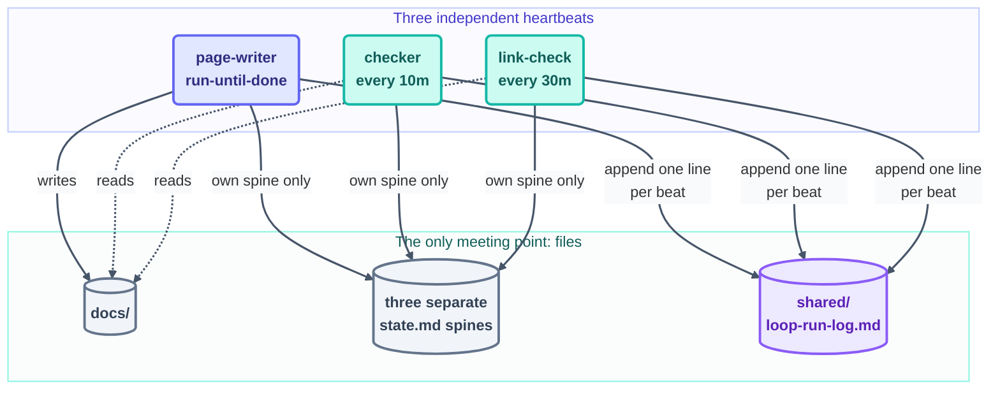

# `loops/` — the loops that build this course

This course about loops is **built by loops**. This folder is the evidence: every loop
that has written any part of this repo lives here, in the open, with its real prompt,
its real stopping condition, and the spine it kept while it ran.

Read these as worked examples. They are not toys written for the lesson — they are the
actual machinery that produced the pages in `docs/`.

## Layout

```text
loops/
├── README.md              ← you are here
├── day1/                  one folder per build day
│   ├── page-writer/       the maker  (L2 — writes docs/)
│   ├── checker/           the grader (L1 — report-only)
│   └── link-check/        the heartbeat (L1 — still running in Day 2)
├── day2/
│   ├── step-writer/       the maker  (L2 — steps, methods, operating)
│   ├── template-checker/  the grader (L1 — PASS/FAIL per §10 rubric)
│   └── quiz-writer/       the second maker (L2 — quiz.md + flashcards.md only)
└── day3/
    ├── kit-stamper/            the workhorse (L2 — stamps starters/ from kit-state.md)
    ├── audit-loop/             the grader (L1 — a script IS the checker)
    ├── patterns-page-loop/    parallel maker (L2 — patterns/, own worktree)
    └── labs-and-advanced-loop/ parallel maker (L2 — projects/appendix/advanced/assessments)
```

Each loop folder holds exactly two files:

| File       | What it is                                                                                       |
| ---------- | ------------------------------------------------------------------------------------------------ |
| `loop.md`  | The loop's **definition** — its six parts, its prompt, its limits. Written before the loop runs. |
| `state.md` | The loop's **spine** — what it remembered between beats. Written by the loop, every beat.        |

## The rules that govern everything here

The shared rulebook is [`LOOP.md`](../LOOP.md) — it is owned by the human, and **no
loop may edit it**. The two rules that shape this folder:

- **State isolation.** A loop reads and writes only its *own* `state.md`. Every other
  loop's state file is read-only to it. This is how loops run at the same time without
  overwriting each other.
- **One owner per path.** Only `page-writer` may write `docs/`. The checkers report
  findings into their own state files and never fix pages themselves — **maker ≠
  checker**, enforced by permissions rather than good intentions.

## Day 1 fleet at a glance

| Loop                                    | Heartbeat                    | Cadence    | Level | Runs | Outcome                     |
| --------------------------------------- | ---------------------------- | ---------- | ----- | ---- | --------------------------- |
| [page-writer](day1/page-writer/loop.md) | conditional (run-until-done) | self-paced | L2    | 21   | success — checklist emptied |
| [checker](day1/checker/loop.md)         | schedule                     | 10m        | L1    | 1    | 3 findings, all resolved    |
| [link-check](day1/link-check/loop.md)   | schedule                     | 30m        | L1    | 1    | clean — 0 broken links      |

Every beat of every run is logged in [`shared/loop-run-log.md`](../shared/loop-run-log.md).
Note that these three loops were **not chained** — no loop called another. Each woke on
its own heartbeat and coordinated purely through files:



## Day 3 fleet at a glance

| Loop | Heartbeat | Cadence | Level | Runs | Status |
| ---- | --------- | ------- | ----- | ---- | ------ |
| [kit-stamper](day3/kit-stamper/loop.md) | conditional (run-until-done) | self-paced | L2 | 0 | not started |
| [audit-loop](day3/audit-loop/loop.md) | schedule | 15m | L1 | 0 | not started |
| [patterns-page-loop](day3/patterns-page-loop/loop.md) | conditional (run-until-done, own worktree) | self-paced | L2 | 0 | not started |
| [labs-and-advanced-loop](day3/labs-and-advanced-loop/loop.md) | conditional (run-until-done) | self-paced | L2 | 0 | not started |

Four loops instead of three — Day 3 is this course's first real **fleet**, not just
parallel single loops. `kit-stamper` is the only writer of `starters/`;
`patterns-page-loop` runs in its own worktree so it never has to wait for
`kit-stamper`; `audit-loop` is a script wearing a checker's hat, not an LLM reading a
rubric. The full checklist of what each of the 20 core loops is and where it came
from lives in [`kit-state.md`](../kit-state.md).

## ⚠️ On the honesty of these files

The Day 1 loops ran on 2026-07-16, but their `loop.md` and `state.md` files were never
committed at the time — the folder was gitignored and then lost.

The files here were **reconstructed on 2026-07-16** from sources that *are* real:
`days-plans/day1-plan.md` (which contains the original loop prompts verbatim),
`shared/loop-run-log.md` (23 logged beats), `shared/loop-budget.md` (including a real
self-throttle alert), and `STATE.md`.

Each `state.md` marks precisely which parts are recovered fact and which are inference.
Day 2's loops write their spines here **as they run**, so no future reconstruction is
needed. The lesson is in [`day1/page-writer/state.md`](day1/page-writer/state.md): a
spine that isn't committed isn't a spine.
