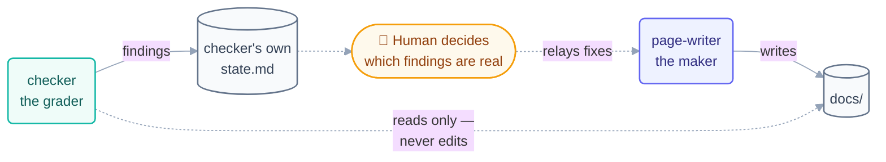

# Loop: `checker` (Day 1)

> The **grader** of the Day 1 fleet. It reads the pages `page-writer` produced and
> reports what's wrong with them. It is structurally incapable of fixing anything — and
> that is the entire point.

## The six parts

| Part                   | This loop                                                                                                   |
| ---------------------- | ----------------------------------------------------------------------------------------------------------- |
| **Heartbeat**          | Schedule — every **10 minutes**. It is never told when a page is ready; it wakes up and looks.              |
| **Body**               | **Read-only on `docs/`.** May write its own `state.md` and append to `shared/loop-run-log.md`. That is all. |
| **Spine**              | [`state.md`](state.md) — findings, and which pages have been reviewed.                                      |
| **Stopping condition** | No unreviewed pages remain and no finding is open.                                                          |
| **Checker**            | Itself — it *is* the checker. Its findings are graded by the human at the checkpoint gate.                  |
| **Human gate**         | The human reads the findings every hour or two and decides which are real.                                  |

**Level: L1 (report-only)** — the mode every loop in this repo starts in. This loop
never left it, by design. It has no path to L2.

## The prompt

Verbatim from [`days-plans/day1-plan.md`](../../../days-plans/day1-plan.md):

```text
/loop 10m Read the newest pages checked off in STATE.md. Verify each one:
follows the page template, links work, matches loop-plan.md. Write
problems to review-notes.md. Do NOT edit the pages yourself.
```

The last sentence is the load-bearing one. **Maker ≠ checker** is not a suggestion here
— it is enforced twice over: once in the prompt, once in the permissions. A loop that
can fix what it grades will always find its own work acceptable.



The circle never closes on its own: the fix path runs **through the human**, not from
checker back to maker directly.

## What it checks

| Check                             | Against                                                                                                                                |
| --------------------------------- | -------------------------------------------------------------------------------------------------------------------------------------- |
| Page follows the **§10 template** | `loop-plan.md` §10 — hook → explanation → mermaid → dual-tool tabs → going-deeper → quiz → Try With AI → when-it-goes-wrong → glossary |
| Relative links resolve            | the file tree                                                                                                                          |
| Content matches the plan          | `loop-plan.md`, `shared/goal.md`                                                                                                       |

## Limits

| Guard            | Value                                        |
| ---------------- | -------------------------------------------- |
| Max runs/day     | 30                                           |
| Max tokens/day   | 100k                                         |
| Sub-agent spawns | 0                                            |
| Kill switch      | `loop-pause-all: on` → exit at start of beat |

Source: [`shared/loop-budget.md`](../../../shared/loop-budget.md). It used **1
run and 15k tokens** — roughly 3% of its allowance. Read-only loops are cheap; this is
why "add a checker" is rarely the thing that breaks your budget.

## Ownership

| Path                                                                 | This loop's access         |
| -------------------------------------------------------------------- | -------------------------- |
| `loops/day1/checker/state.md`                                        | **write** (sole owner)     |
| `shared/loop-run-log.md`                                             | **append-only**            |
| `docs/`                                                              | **read-only** — never edit |
| every other loop's `state.md`                                        | read-only                  |
| `LOOP.md`, `CLAUDE.md`, `loop-plan.md`, `shared/goal.md`, `STATE.md` | read-only                  |

Found a problem? It goes in [`state.md`](state.md). The fix is `page-writer`'s job.

## The three valid stops

- **Success** — all pages reviewed, no open findings. ← *how the run ended*
- **Limit** — 30 runs or 100k tokens.
- **No progress** — nothing changed for 3 consecutive beats.

## A note on the 10-minute heartbeat

Why 10 minutes and not "whenever a page is done"? Because **nothing connects these
loops.** `page-writer` never calls `checker`. There is no chain, no orchestrator, no
event. The checker simply wakes every 10 minutes and asks "what's new?"

That looks wasteful and is actually the robust choice: if `page-writer` crashes,
`checker` keeps waking. If `checker` crashes, `page-writer` never notices. Coordination
through **shared files** rather than direct calls is what lets one loop die without
taking the fleet with it.
