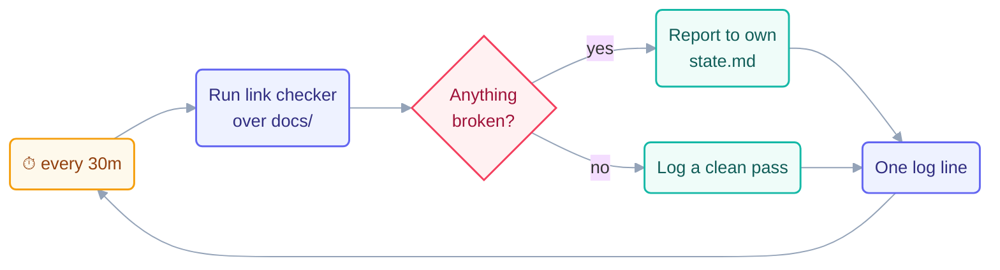

# Loop: `link-check` (Day 1)

> The **heartbeat** of the Day 1 fleet — the smallest loop in the repo. It runs a link
> checker over `docs/` on a timer and reports anything broken. That's the whole job.

## The six parts

| Part                   | This loop                                                                                                             |
| ---------------------- | --------------------------------------------------------------------------------------------------------------------- |
| **Heartbeat**          | Schedule — every **30 minutes**, all day.                                                                             |
| **Body**               | Runs a link checker. **Read-only on `docs/`.** May write its own `state.md` and append to `shared/loop-run-log.md`.   |
| **Spine**              | [`state.md`](state.md) — broken links found, and when it last ran clean.                                              |
| **Stopping condition** | A pass over `docs/` with zero broken links.                                                                           |
| **Checker**            | Itself — the link checker *is* a checker. See the note below.                                                         |
| **Human gate**         | The human reads its findings; the "no broken links" line in `shared/goal.md` is part of the Day 1 definition of done. |

**Level: L1 (report-only)** — it reports broken links, it never repairs them. Repair is
`page-writer`'s job.

## The prompt

Verbatim from [`days-plans/day1-plan.md`](../../../days-plans/day1-plan.md):

```text
/loop 30m Run the link checker on docs/. If anything is broken,
append it to review-notes.md.
```

Two sentences. That's a complete, production loop. **Loops do not have to be big** —
this one has a real heartbeat, a real body, a real spine, a provable stop, and a human
gate, in fewer words than most commit messages.



## Why this loop is the best one to learn from

The checker it uses is **a script, not a model.** A link either resolves or it doesn't.
There is no judgement, no prompt, no "does this feel right?" — the check is a fact.

That makes this loop's stopping condition the strongest in the fleet:

| Loop          | Its stop                                | How provable?                    |
| ------------- | --------------------------------------- | -------------------------------- |
| `page-writer` | all boxes checked                       | strong — greps its own spine     |
| `checker`     | template followed, content matches plan | **weak** — needs judgement       |
| `link-check`  | zero broken links                       | **strongest** — a script decides |

**When you can make a script the checker, do it.** It costs almost nothing, it never
has an opinion, and it cannot be argued with. Day 3 takes this further —
`scripts/loop-ready-audit.mjs` is a whole audit loop whose checker is pure code.

This loop is also mirrored in CI as
[`.github/workflows/link-check.yml`](../../../.github/workflows/link-check.yml)
— the same check runs on every push. **The loop catches it in 30 minutes; CI catches it
forever.** A loop that proves its worth is a good candidate for promotion into CI.

## Limits

| Guard            | Value                                        |
| ---------------- | -------------------------------------------- |
| Max runs/day     | 20                                           |
| Max tokens/day   | 50k                                          |
| Sub-agent spawns | 0                                            |
| Kill switch      | `loop-pause-all: on` → exit at start of beat |

Source: [`shared/loop-budget.md`](../../../shared/loop-budget.md). It used **1
run and 5k tokens** — the cheapest loop in the fleet by a wide margin.

## Ownership

| Path                             | This loop's access     |
| -------------------------------- | ---------------------- |
| `loops/day1/link-check/state.md` | **write** (sole owner) |
| `shared/loop-run-log.md`         | **append-only**        |
| `docs/`                          | **read-only**          |
| everything else                  | read-only              |

## The three valid stops

- **Success** — a clean pass, zero broken links. ← *how the run ended*
- **Limit** — 20 runs or 50k tokens.
- **No progress** — nothing changed for 3 consecutive beats.
