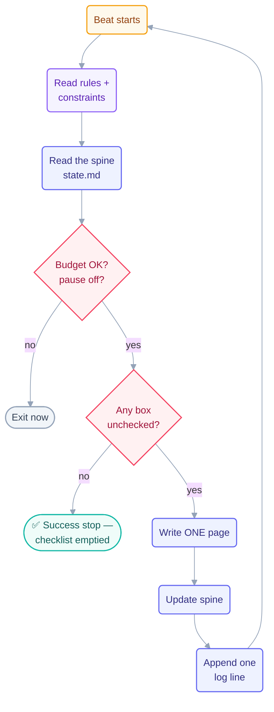

# Loop: `page-writer` (Day 1)

> The **maker** of the Day 1 fleet. It wrote the entry layer of the course — one page
> per beat — and stopped when the checklist was empty. It is the only Day 1 loop with
> permission to write `docs/`.

## The six parts

| Part                   | This loop                                                                                                                        |
| ---------------------- | -------------------------------------------------------------------------------------------------------------------------------- |
| **Heartbeat**          | Conditional — *run-until-done*. Self-paced: the next beat starts as soon as the last one finishes. Not a schedule.               |
| **Body**               | May write `docs/` and course content files. May append to `shared/loop-run-log.md`. May write its own `state.md`. Nothing else.  |
| **Spine**              | [`state.md`](state.md) — the checklist of pages plus what was finished. Rewritten every beat.                                    |
| **Stopping condition** | Every box in the Day 1 page checklist is checked. Machine-checkable — the loop greps its own spine.                              |
| **Checker**            | The [`checker`](../checker/loop.md) loop. **This loop never grades its own pages.**                                              |
| **Human gate**         | The human writes the `README.md` hero, and declares the Day 1 checkpoint. This loop never declares itself done at the day level. |

**Level: L2 (assisted)** — it applies real edits to `docs/`, with a human reading the
checker's findings. It did not begin at L2: the human watched a full beat succeed at L1
before granting write access, per rule 4 of `CLAUDE.md`.

## The prompt

Taken verbatim from [`days-plans/day1-plan.md`](../../../days-plans/day1-plan.md):

```text
/loop Read STATE.md. Pick the FIRST unchecked page. Write it following
the master plan (loop-plan.md). Then check it off in STATE.md and log
one line in loop-run-log.md. Stop when every box is checked.
```

Read it closely — the whole loop is in four sentences:

1. **Read the spine** (`STATE.md`) — never trust memory across beats.
2. **One unit of work** — *the FIRST unchecked page*, not "some pages", not "as many as
   you can". One beat, one page.
3. **Update the spine, then log** — in that order, so an interruption between them costs
   a log line, not the work.
4. **A provable stop** — "every box is checked" is a fact the loop can verify. Contrast
   with "stop when the docs look good", which is not a stop.

## Limits (the guardrails)

| Guard            | Value                                        | Source                                                    |
| ---------------- | -------------------------------------------- | --------------------------------------------------------- |
| Max runs/day     | 25                                           | [`shared/loop-budget.md`](../../../shared/loop-budget.md) |
| Max tokens/day   | 550k                                         | same                                                      |
| Sub-agent spawns | 0                                            | same                                                      |
| Self-throttle    | at 80% of cap → report-only                  | budget rule 1                                             |
| Kill switch      | `loop-pause-all: on` → exit at start of beat | budget kill switch                                        |

> **Both caps were raised mid-day.** The loop began with 20 runs / 400k tokens, hit ≈79%
> of the token cap after 17 runs with 6 checklist items left, self-throttled to
> report-only, and stopped — exactly as designed. The human raised the caps to 25 / 550k
> and restarted it. The original alert is still in `shared/loop-budget.md`. **This is
> the loop working, not failing:** it ran out of budget and *stopped and asked* rather
> than quietly pushing on.

## Ownership

| Path                                                                 | This loop's access     |
| -------------------------------------------------------------------- | ---------------------- |
| `docs/` and course content                                           | **write** (sole owner) |
| `loops/day1/page-writer/state.md`                                    | **write** (sole owner) |
| `shared/loop-run-log.md`                                             | **append-only**        |
| every other `state.md`                                               | read-only              |
| `LOOP.md`, `CLAUDE.md`, `loop-plan.md`, `shared/goal.md`, `STATE.md` | read-only              |

Need a change outside that list? Write the request into `state.md` under
**Escalations** and stop touching the path.

## Every beat, in order

1. Read `loop-constraints.md` and `LOOP.md`.
2. Read this file, [`state.md`](state.md), and `shared/goal.md`.
3. Check `shared/loop-budget.md` — over budget or `loop-pause-all` set → exit now.
4. Write **one** page.
5. Update [`state.md`](state.md).
6. Append exactly one line to `shared/loop-run-log.md`.



## The three valid stops

- **Success** — every checklist box checked. ← *this is how the run ended*
- **Limit** — 25 runs or 550k tokens.
- **No progress** — nothing changed for 3 consecutive beats.

"Feels done" is not a stop.
