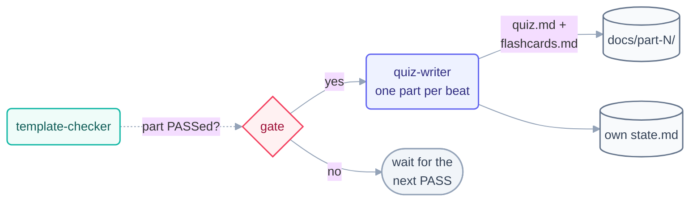

# Loop: `quiz-writer` (Day 2)

> The **second maker** of the Day 2 fleet — the first time two makers run in the same
> repo at once. It writes each part's `quiz.md` and `flashcards.md`, one part per beat,
> and only for parts the `template-checker` has PASSed. It never touches a step page.

## The six parts

| Part                   | This loop                                                                                                     |
| ---------------------- | ------------------------------------------------------------------------------------------------------------- |
| **Heartbeat**          | Conditional — run-until-done over the six parts, gated on checker PASS per part.                              |
| **Body**               | May write **only** `docs/part-*/quiz.md` and `docs/part-*/flashcards.md`. Own `state.md`. Run-log appends.    |
| **Spine**              | [`state.md`](state.md) — which parts are covered.                                                             |
| **Stopping condition** | All 6 quizzes + all 5 flashcard sets exist (part 5 has no flashcards). Machine-checkable.                     |
| **Checker**            | The [`template-checker`](../template-checker/loop.md) grades quiz/flashcard format too.                       |
| **Human gate**         | The human merges/approves at the Day 2 checkpoint.                                                            |

**Level: L2 (assisted)** — same basis as `step-writer`.

## The prompt

Taken verbatim from [`days-plans/day2-plan.md`](../../../days-plans/day2-plan.md):

```text
/loop In a worktree: read each finished part in docs/. Write that part's
quiz.md (5 questions + answers) and flashcards.md (10 cards).
Track progress in quiz-state.md. Stop when all 6 parts are covered.
```

**Isolation note.** The plan says "in a worktree" because two makers writing the same
folder tree can collide. The ownership map achieves the same isolation by path — this
loop owns *only* `quiz.md`/`flashcards.md`, which `step-writer` never writes. Running
in a shared tree with disjoint ownership is the file-level equivalent of a worktree;
if the two makers ever need the same file, a real `git worktree` becomes mandatory.



## Limits

| Guard            | Value                                        |
| ---------------- | -------------------------------------------- |
| Max runs/day     | 10                                           |
| Max tokens/day   | 150k                                         |
| Sub-agent spawns | 0                                            |
| Kill switch      | `loop-pause-all: on` → exit at start of beat |

Source: [`shared/loop-budget.md`](../../../shared/loop-budget.md).

## Ownership

| Path                                               | This loop's access     |
| -------------------------------------------------- | ---------------------- |
| `docs/part-*/quiz.md`, `docs/part-*/flashcards.md` | **write** (sole owner) |
| `loops/day2/quiz-writer/state.md`                  | **write** (sole owner) |
| `shared/loop-run-log.md`                           | **append-only**        |
| everything else                                    | read-only              |

## The three valid stops

- **Success** — 6 quizzes + 5 flashcard sets exist and PASS.
- **Limit** — 10 runs or 150k tokens.
- **No progress** — nothing changed for 3 consecutive beats.
