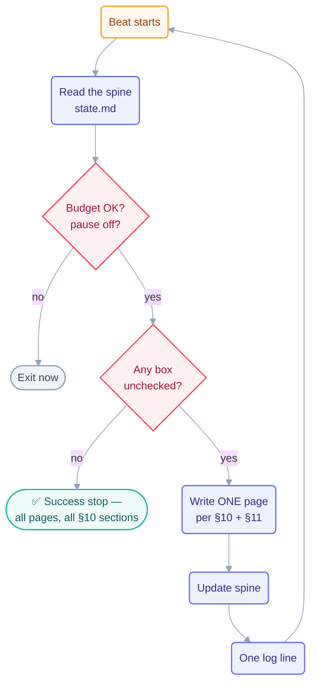

# Loop: `step-writer` (Day 2)

> The **maker** of the Day 2 fleet — Day 1's `page-writer` pattern reused on a bigger
> checklist. It writes the whole conceptual course body (step pages, part indexes,
> methods, operating handbook), one page per beat, and stops when the checklist is
> empty. It is the only Day 2 loop with permission to write its slice of `docs/`.

## The six parts

| Part                   | This loop                                                                                                                          |
| ---------------------- | ---------------------------------------------------------------------------------------------------------------------------------- |
| **Heartbeat**          | Conditional — *run-until-done*. Self-paced: the next beat starts as soon as the last one finishes.                                 |
| **Body**               | May write `docs/part-*` (except `quiz.md`/`flashcards.md`), `docs/methods/`, `docs/operating/`. Own `state.md`. Run-log appends.   |
| **Spine**              | [`state.md`](state.md) — the Day 2 page checklist plus what was finished. Updated every beat.                                      |
| **Stopping condition** | Every box in the Day 2 step-writer checklist is checked AND each page carries all §10 sections. Machine-checkable.                 |
| **Checker**            | The [`template-checker`](../template-checker/loop.md) loop. **This loop never grades its own pages.**                              |
| **Human gate**         | The human spot-reads one page per part and declares the Day 2 checkpoint. This loop never declares day-level done.                 |

**Level: L2 (assisted)** — inherited from Day 1: the pattern earned L2 by running a full
Day 1 at L1→L2 with a human watching (rule 4 of `CLAUDE.md`); the human explicitly
started this Day 2 run.

## The prompt

Taken verbatim from [`days-plans/day2-plan.md`](../../../days-plans/day2-plan.md):

```text
/loop Read STATE.md. Take the FIRST unchecked step page. Write it using
the 9-part page template in loop-plan.md §10, pulling content from the
roadmap in §11. Check it off, log one line in loop-run-log.md.
Stop when all step pages are checked.
```

Day 2's refinement over Day 1: the stop is not just "boxes checked" but "boxes checked
**and** each page contains all §10 sections" — the stop got *more* provable, not less.



## Limits (the guardrails)

| Guard            | Value                                        | Source                                                    |
| ---------------- | -------------------------------------------- | --------------------------------------------------------- |
| Max runs/day     | 40                                           | [`shared/loop-budget.md`](../../../shared/loop-budget.md) |
| Max tokens/day   | 700k                                         | same                                                      |
| Sub-agent spawns | 0                                            | same                                                      |
| Self-throttle    | at 80% of the **current** cap → report-only  | budget rule 1 — the Day 1 bug, fixed                      |
| Kill switch      | `loop-pause-all: on` → exit at start of beat | budget kill switch                                        |

> Day 1's spine recorded a real bug: after the human raised the caps, the 80% line kept
> measuring against the *old* cap and the loop ran to ≈90%. Day 2's rule is explicit:
> **re-read the cap from `shared/loop-budget.md` at the start of every beat.**

## Ownership

| Path                                                                 | This loop's access     |
| -------------------------------------------------------------------- | ---------------------- |
| `docs/part-*` step pages + `README.md` (NOT quiz/flashcards)         | **write** (sole owner) |
| `docs/methods/`, `docs/operating/`                                   | **write** (sole owner) |
| `loops/day2/step-writer/state.md`                                    | **write** (sole owner) |
| `shared/loop-run-log.md`                                             | **append-only**        |
| `docs/part-*/quiz.md`, `docs/part-*/flashcards.md`                   | read-only — `quiz-writer` owns them |
| every other `state.md`                                               | read-only              |
| `LOOP.md`, `CLAUDE.md`, `loop-plan.md`, `shared/goal.md`, `STATE.md` | read-only              |

## The three valid stops

- **Success** — every checklist box checked, all §10 sections present per page.
- **Limit** — 40 runs or 700k tokens.
- **No progress** — nothing changed for 3 consecutive beats.

"Feels done" is not a stop.
