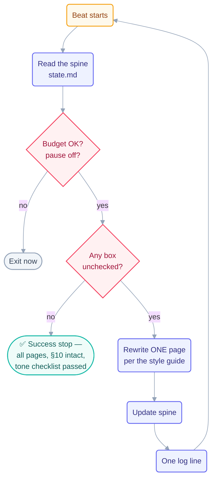

# Loop: `step-writer` (Day 2)

> The **maker** of the Day 2 fleet — Day 1's `page-writer` pattern reused on a bigger
> checklist. It writes the whole conceptual course body (step pages, part indexes,
> methods, operating handbook), one page per beat, and stops when the checklist is
> empty. It is the only Day 2 loop with permission to write its slice of `docs/`.

> **Current mission: pass 3 — banner cleanup + starter-command reference (2026-07-19).**
> Passes 1 and 2 are complete (all 36 pages written, then tone-rewritten). Pass 3 is a
> small, mechanical, human-requested pass with two work groups:
>
> 1. **Remove the section banners.** The human finds the SVG banner at the top of every
>    section landing page unprofessional and does not want one on each part. Delete the
>    leading `` image line, and the blank line after it,
>    from all 11 landing pages. Nothing else on the page changes.
> 2. **Add a starter-command reference.** Create `starters/getting-started.md` with two
>    clearly separated sections — **Manual setup** (the existing clone-and-fill flow, kept
>    exactly as it is, so anyone who prefers to set a loop up by hand still can) and
>    **Starter commands** (the one-line scaffolding commands from the
>    `cobusgreyling/loop-engineering` repo, S7). Write both in plain, professional prose —
>    no flashy or informal wording. Then link the new page from `starters/README.md`.
>
> The exact banner list, the exact S7 commands, and the wording rules are baked into
> [`state.md`](state.md). Read it at the start of every beat.
>
> **Pass 2 (complete, 2026-07-18):** rewrote every page to match
> [`shared/style-guide.md`](../../../shared/style-guide.md) — same pages, same §10
> structure, same facts; voice only. Read the style guide before any prose change.

## The six parts

| Part                   | This loop                                                                                                                                |
| ---------------------- | ---------------------------------------------------------------------------------------------------------------------------------------- |
| **Heartbeat**          | Conditional — *run-until-done*. Self-paced: the next beat starts as soon as the last one finishes.                                       |
| **Body**               | May write `docs/*-part-*` (except `quiz.md`/`flashcards.md`), `docs/09-methods/`, `docs/10-operating/`. Own `state.md`. Run-log appends. |
| **Spine**              | [`state.md`](state.md) — the pass-2 rewrite checklist plus what was finished. Updated every beat.                                        |
| **Stopping condition** | Pass 3: every pass-3 box checked AND `grep -rn 'assets/banner' docs/` returns nothing AND `starters/getting-started.md` exists with both a **Manual setup** and a **Starter commands** section. Machine-checkable. |
| **Checker**            | The [`template-checker`](../template-checker/loop.md) loop. **This loop never grades its own pages.**                                    |
| **Human gate**         | The human spot-reads one page per part and declares the Day 2 checkpoint. This loop never declares day-level done.                       |

**Level: L2 (assisted)** — inherited from Day 1: the pattern earned L2 by running a full
Day 1 at L1→L2 with a human watching (rule 4 of `CLAUDE.md`); the human explicitly
started this Day 2 run.

## The prompt

Pass 3 (current — the banner + starter-command pass):

```text
/loop Read loops/day2/step-writer/state.md. Take the FIRST unchecked item in
the pass-3 checklist. If it is a banner removal: delete the leading banner
image line, and the blank line after it, from that page — and nothing else.
If it is the starter-command file: create starters/getting-started.md with a
"Manual setup" section and a "Starter commands" section exactly as state.md
specifies, in plain professional prose, then add a link to it from
starters/README.md. Check the item off, append one line to
shared/loop-run-log.md. Stop when every pass-3 box is checked.
```

Pass 2 (complete — the tone rewrite):

```text
/loop Read loops/day2/step-writer/state.md and shared/style-guide.md.
Take the FIRST unchecked page in the pass-2 tone-rewrite checklist.
Rewrite its prose to match the style guide's rules. Keep every §10
section. Keep every EXISTING mermaid diagram, the code tabs, the
glossary line, and the Sources footer byte-identical — change tone,
not facts, and never touch references. Where a picture would explain
faster than the prose (a flow, a contrast, a timeline), you MAY add
ONE new mermaid diagram per the style guide's diagram rules — most
pages need none. Check the page off, log one line in
shared/loop-run-log.md. Stop when every page is checked.
```

Pass 1 (completed 2026-07-17, kept for the record — taken verbatim from
[`days-plans/day2-plan.md`](../../../days-plans/day2-plan.md)):

```text
/loop Read STATE.md. Take the FIRST unchecked step page. Write it using
the 9-part page template in loop-plan.md §10, pulling content from the
roadmap in §11. Check it off, log one line in loop-run-log.md.
Stop when all step pages are checked.
```

Day 2's refinement over Day 1: the stop is not just "boxes checked" but "boxes checked
**and** each page contains all §10 sections" — the stop got *more* provable, not less.
Pass 2 tightens it again: the page must also pass the tone checklist at the bottom of
[`shared/style-guide.md`](../../../shared/style-guide.md), graded by the
`template-checker`, never by this loop.



## Limits (the guardrails)

| Guard            | Value                                        | Source                                                    |
| ---------------- | -------------------------------------------- | --------------------------------------------------------- |
| Max runs/day     | 40                                           | [`shared/loop-budget.md`](../../../shared/loop-budget.md) |
| Max tokens/day   | 700k                                         | same                                                      |
| Sub-agent spawns | 0                                            | same                                                      |
| Self-throttle    | at 80% of the **current** cap → report-only  | budget rule 1 — the Day 1 bug, fixed                      |
| Kill switch      | `loop-pause-all: on` → exit at start of beat | budget kill switch                                        |

> Day 1's spine recorded a real bug: after the human raised the caps, the 80% line kept
> measuring against the *old* cap and the loop ran to ≈90%. Day 2's rule is explicit:
> **re-read the cap from `shared/loop-budget.md` at the start of every beat.**

## Ownership

| Path                                                                 | This loop's access     |
| -------------------------------------------------------------------- | ---------------------- |
| `docs/*-part-*` step pages + `README.md` (NOT quiz/flashcards)       | **write** (sole owner) |
| `docs/09-methods/`, `docs/10-operating/`                             | **write** (sole owner) |
| `starters/` (pass-3 grant — `getting-started.md` + a link from `README.md`) | **write** (pass-3 grant) |
| `docs/00-start-here/README.md`, `docs/01-prerequisites/environment-setup.md`, `docs/02-foundations/mental-models.md` — **banner line only** (pass-3 grant; page-writer retired) | **write** (pass-3 grant) |
| `loops/day2/step-writer/state.md`                                    | **write** (sole owner) |
| `shared/loop-run-log.md`                                             | **append-only**        |
| `docs/*-part-*/quiz.md` + `flashcards.md` (`quiz-writer` owns)       | read-only              |
| every other `state.md`                                               | read-only              |
| `shared/style-guide.md` (read at the start of every beat)            | read-only              |
| `LOOP.md`, `CLAUDE.md`, `loop-plan.md`, `shared/goal.md`, `STATE.md` | read-only              |

## The three valid stops

- **Success** — every pass-3 box checked: all 11 banners gone (`grep` clean) and
  `starters/getting-started.md` present with both required sections (per the
  `template-checker`'s verdicts). This loop never grades its own work.
- **Limit** — 40 runs or 700k tokens.
- **No progress** — nothing changed for 3 consecutive beats.

"Feels done" is not a stop.
