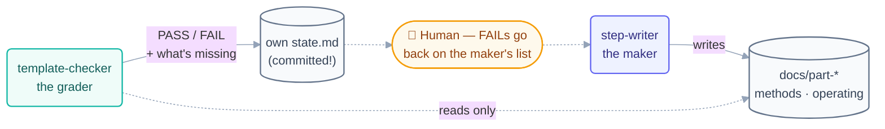

# Loop: `template-checker` (Day 2)

> The **grader** of the Day 2 fleet — Day 1's `checker` pattern with a sharper rubric.
> It verifies every finished page against the §10 template, PASS/FAIL per page, and is
> structurally incapable of fixing anything.

## The six parts

| Part                   | This loop                                                                                                    |
| ---------------------- | ------------------------------------------------------------------------------------------------------------ |
| **Heartbeat**          | Schedule — specified at **20m**. See the cadence note below before trusting that number.                     |
| **Body**               | **Read-only on `docs/`.** May write its own `state.md` and append to `shared/loop-run-log.md`. That is all.  |
| **Spine**              | [`state.md`](state.md) — PASS/FAIL per page, one line saying what is missing.                                |
| **Stopping condition** | Every checked-off page has a PASS verdict and no FAIL is open.                                               |
| **Checker**            | Itself — it *is* the checker. Its verdicts are graded by the human at the checkpoint gate.                   |
| **Human gate**         | The human spot-reads one page per part; FAILed pages go back on the `step-writer` list via the human.        |

**Level: L1 (report-only)** — permanent, by design. No path to L2.

## The prompt

Taken verbatim from [`days-plans/day2-plan.md`](../../../days-plans/day2-plan.md):

```text
/loop 20m For each newly finished page in STATE.md, verify it has ALL of:
hook, explanation, mermaid block, both code tabs, quiz question,
exercise, troubleshooting box. Mark PASS/FAIL per page in
review-notes.md with one line saying what is missing. Read-only — never fix.
```

Two Day 1 lessons applied:

1. **Findings go somewhere durable.** Day 1's `review-notes.md` was never committed and
   the findings are lost forever. This loop writes verdicts into its own committed
   [`state.md`](state.md).
2. **Question the cadence.** Day 1's checker was specified at 10m but reality wanted
   "once, at the end" — it logged exactly one useful beat. The 20m spec here is treated
   as a *ceiling*; batching reviews per finished part is a valid reading.



## The rubric (one row per §10 section)

| # | Must be present               | How it's detected                          |
| - | ----------------------------- | ------------------------------------------ |
| 1 | Hook                          | a concrete-scenario opening section        |
| 2 | Plain-English explanation     | body prose between hook and diagram        |
| 3 | Mermaid diagram               | at least one mermaid fence                 |
| 4 | Dual-tool code tabs           | a claude fence **and** an opencode fence   |
| 5 | Going-deeper callout          | a `> [!NOTE]` **Going deeper** block       |
| 6 | Check yourself                | question + `<details>` reveal              |
| 7 | Try With AI                   | a hands-on exercise section                |
| 8 | When it goes wrong            | symptom → cause → fix table                |
| 9 | Glossary popovers             | the glossary-terms footer line             |

Index pages (`README.md`), `methods/`, and `operating/` pages are **structural pages**,
not concept pages — they are graded on: purpose stated, working links, at least one
diagram or table, no broken template imports. (Same reading Day 1's checker applied to
`glossary.md`.)

## Limits

| Guard            | Value                                        |
| ---------------- | -------------------------------------------- |
| Max runs/day     | 12                                           |
| Max tokens/day   | 150k                                         |
| Sub-agent spawns | 0                                            |
| Kill switch      | `loop-pause-all: on` → exit at start of beat |

Source: [`shared/loop-budget.md`](../../../shared/loop-budget.md).

## Ownership

| Path                                                                 | This loop's access         |
| -------------------------------------------------------------------- | -------------------------- |
| `loops/day2/template-checker/state.md`                               | **write** (sole owner)     |
| `shared/loop-run-log.md`                                             | **append-only**            |
| `docs/`                                                              | **read-only** — never edit |
| every other loop's `state.md`                                        | read-only                  |

## The three valid stops

- **Success** — every finished page reviewed, zero open FAILs.
- **Limit** — 12 runs or 150k tokens.
- **No progress** — nothing new to review for 3 consecutive beats.
