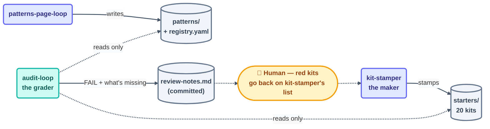

# Loop: `audit-loop` (Day 3)

> The **grader** of the Day 3 fleet — Day 2's `template-checker` pattern, but the
> rubric is a deterministic script instead of an LLM reading a rubric table. It runs
> `loop-ready-audit.mjs` and `validate-registry.mjs` against every kit in `starters/`
> and logs failures. It is structurally incapable of fixing anything.

## The six parts

| Part | This loop |
| --- | --- |
| **Heartbeat** | Schedule — **15m ceiling**. Batching a review per newly-stamped kit is a valid reading (Day 2's `template-checker` lesson: the interval is a ceiling, not a mandate). |
| **Body** | **Read-only on `starters/` and `patterns/`.** May write [`review-notes.md`](../../../review-notes.md) (sole owner) and its own `state.md`. That is all. |
| **Spine** | [`state.md`](state.md) — kits checked, failures found, run count. |
| **Stopping condition** | None it declares itself — this loop runs for as long as `kit-stamper` is producing kits. It stops when `kit-stamper` hits its own stop and one final clean pass finds zero FAILs. |
| **Checker** | Itself — it *is* the checker. Its verdicts are graded by the human at the Day 3 checkpoint. |
| **Human gate** | The human reads `review-notes.md`; any FAIL sends that kit back onto `kit-stamper`'s unbuilt list via the human (or via the "red main blocks everything" priority rule below). |

**Level: L1 (report-only)** — permanent, by design. No path to L2. A script-based
checker never needs write access to do its job.

## The prompt

Taken verbatim from [`days-plans/day3-plan.md`](../../../days-plans/day3-plan.md):

```text
/loop 15m Run scripts/loop-ready-audit.mjs on every kit in starters/.
Append failures to review-notes.md. Also run validate-registry.mjs.
Read-only.
```



## Limits

| Guard | Value |
| --- | --- |
| Max runs/day | 60 |
| Max tokens/day | 100k |
| Sub-agent spawns | 0 |
| Kill switch | `loop-pause-all: on` → exit at start of beat |

Source: [`shared/loop-budget.md`](../../../shared/loop-budget.md).

## Ownership

| Path | This loop's access |
| --- | --- |
| `review-notes.md` | **write** (sole owner) |
| `loops/day3/audit-loop/state.md` | **write** (sole owner) |
| `shared/loop-run-log.md` | **append-only** |
| `starters/`, `patterns/` | **read-only** — never edit |
| `kit-state.md`, `patterns-state.md` | read-only |
| every other loop's `state.md` | read-only |

## The three valid stops

- **Success** — a full pass finds zero open FAILs across every kit that
  `kit-stamper` has checked off, and `kit-stamper` itself has hit its own stop.
- **Limit** — 60 runs or 100k tokens.
- **No progress** — nothing new to check for 3 consecutive beats (i.e.
  `kit-stamper` is idle and the last pass was already clean).

## Priority rule (from the coordination contract)

"Red main blocks everything" — if this loop's last pass has any open FAIL,
`kit-stamper` should fix that kit before stamping a new one. This loop does not
enforce that itself (it's read-only); it is enforced by the human reading
`review-notes.md`, or by `kit-stamper`'s own beat-start check.
