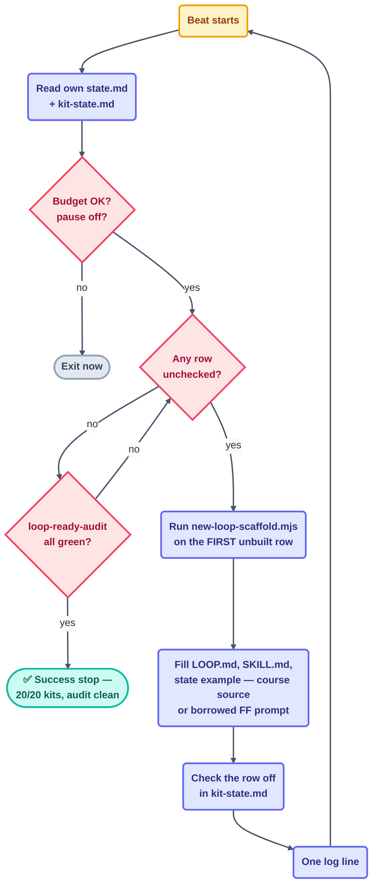

# Loop: `kit-stamper` (Day 3)

> The **maker** and workhorse of the Day 3 fleet — Day 2's `step-writer` pattern
> (one checklist, one item per beat, stop when it's empty) reused on kit folders
> instead of pages. It stamps each of the 20 core loops in
> [`kit-state.md`](../../../kit-state.md) from
> [`starters/_template/`](../../../starters/_template/), then fills in the
> loop-specific parts. It is the **only** Day 3 loop with write access to `starters/`.

## The six parts

| Part | This loop |
| --- | --- |
| **Heartbeat** | Conditional — *run-until-done*. Self-paced: the next beat starts as soon as the last one finishes. |
| **Body** | May write new `starters/<name>/` folders and [`kit-state.md`](../../../kit-state.md) (sole owner, checkbox column only), plus its own `state.md`. Read-only on [`review-notes.md`](../../../review-notes.md), `starters/_template/`, and every other loop's state. |
| **Spine** | [`state.md`](state.md) — which kit is in progress, run count, tokens used. The actual work checklist lives in `kit-state.md`, not here (other loops need to read it). |
| **Stopping condition** | All 20 rows in `kit-state.md` are checked off **and** `node scripts/loop-ready-audit.mjs` exits 0 for every kit. Machine-checkable — never "looks done". |
| **Checker** | [`audit-loop`](../audit-loop/loop.md) — a deterministic script, not this loop's own opinion. A kit checked off here that later FAILs the audit goes back on the unbuilt list. |
| **Human gate** | The human spot-checks 3 random kits deeply and decides whether any Group-B (Forward Future) kit's borrowed prompt needs trimming before commit. Only the human declares the Day 3 checkpoint. |

**Level: L2 (assisted — writes `starters/`)** — inherited by precedent: the
maker→L2 pattern already proved itself across `page-writer` (Day 1, L1→L2 watched)
and `step-writer` (Day 2). The human explicitly started this Day 3 run at L2.

## The prompt

Taken verbatim from [`days-plans/day3-plan.md`](../../../days-plans/day3-plan.md):

```text
/loop Read kit-state.md. Take the FIRST unbuilt loop. Run
scripts/new-loop-scaffold.mjs to stamp the kit from _template/, then
fill in the loop-specific parts: LOOP.md (job, stops, gate), the
SKILL.md prompt, and the state example. Check it off. Stop when
all 20 core kits exist.
```

For the 13 Group-B kits (`kit-state.md` marks the source), the "fill in" step means:
fetch that loop's real prompt text and author credit from its Forward Future detail
page and drop it into `LOOP.md`'s prompt block and a new `Source:` line — not written
from scratch. Group-A kits (the original 7) are filled from the course's own sources
(S1–S9), exactly as `loop-plan.md` §15A–§15D already specifies them.



## Limits (the guardrails)

| Guard | Value | Source |
| --- | --- | --- |
| Max runs/day | 25 | [`shared/loop-budget.md`](../../../shared/loop-budget.md) |
| Max tokens/day | 900k | same |
| Sub-agent spawns | 0 | same |
| Self-throttle | at 80% of the **current** cap → report-only | re-read the cap every beat (Day 2's fixed bug) |
| Kill switch | `loop-pause-all: on` → exit at start of beat | budget kill switch |

## Ownership

| Path | This loop's access |
| --- | --- |
| `starters/<name>/` (new kit folders only — never `_template/`) | **write** (sole owner) |
| `kit-state.md` (checkbox column) | **write** (sole owner) |
| `loops/day3/kit-stamper/state.md` | **write** (sole owner) |
| `shared/loop-run-log.md` | **append-only** |
| `review-notes.md` (audit-loop owns) | read-only |
| `starters/_template/` | read-only |
| every other loop's `state.md` | read-only |
| `LOOP.md`, `CLAUDE.md`, `loop-plan.md`, `shared/goal.md`, `STATE.md` | read-only |

## The three valid stops

- **Success** — 20/20 rows checked in `kit-state.md` AND `loop-ready-audit.mjs`
  exits 0 for every kit.
- **Limit** — 25 runs or 900k tokens.
- **No progress** — nothing changed for 3 consecutive beats.

"Feels done" is not a stop.
