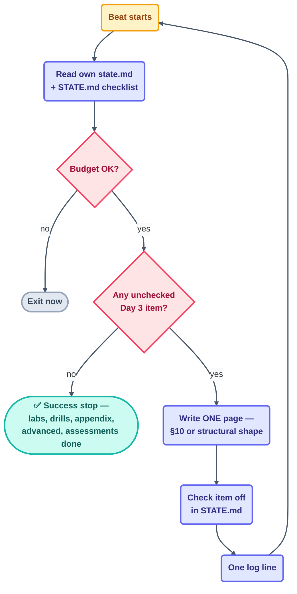

# Loop: `labs-and-advanced-loop` (Day 3)

> The third parallel maker — Day 2's `step-writer` pattern reused verbatim on a new
> checklist. It writes everything in Day 3 that is an ordinary page rather than a
> kit or a spec: the practice labs, drills, cheatsheets, the ultra-pro `advanced/`
> tier, and the assessments.

## The six parts

| Part | This loop |
| --- | --- |
| **Heartbeat** | Conditional — *run-until-done*, self-paced. |
| **Body** | May write `docs/projects/` (8 labs + 3 drills + `solutions/`), `docs/appendix/routines.md` + `cheatsheets/`, `docs/advanced/` (7 pages), `docs/assessments/`. Own `state.md`. Run-log appends. |
| **Spine** | [`state.md`](state.md) — run history. The checklist itself is a new Day 3 section in [`STATE.md`](../../../STATE.md), reusing `step-writer`'s exact mechanic. |
| **Stopping condition** | Every item in the Day 3 checklist section of `STATE.md` is checked, each page has all §10 sections (concept pages) or its structural-page equivalent, and link-check is clean on the new paths. |
| **Checker** | [`template-checker`](../../day2/template-checker/loop.md) — reused unchanged; it already grades any page against the §10 rubric regardless of which loop wrote it. This loop never grades its own pages. |
| **Human gate** | The human spot-reads one lab, one drill, and one advanced page before the Day 3 checkpoint. |

**Level: L2 (assisted — writes `docs/`)** — same precedent as `step-writer`, whose
pattern this loop reuses without change.

## The prompt

Per [`days-plans/day3-plan.md`](../../../days-plans/day3-plan.md) §"Loop 4":

```text
/loop Read STATE.md. Take the FIRST unchecked item in the Day 3 practice/
advanced/assessments checklist. Write it using the §10 template (concept
pages) or the matching structural shape (labs, cheatsheets, rubrics).
Check it off, log one line in shared/loop-run-log.md. Stop when every
item in the checklist is checked.
```



## Limits

| Guard | Value |
| --- | --- |
| Max runs/day | 45 |
| Max tokens/day | 750k |
| Sub-agent spawns | 0 |
| Self-throttle | at 80% of the **current** cap → report-only; re-read the cap every beat |
| Kill switch | `loop-pause-all: on` → exit at start of beat |

Source: [`shared/loop-budget.md`](../../../shared/loop-budget.md).

## Ownership

| Path | This loop's access |
| --- | --- |
| `docs/projects/`, `docs/appendix/`, `docs/advanced/`, `docs/assessments/` | **write** (sole owner) |
| Day 3 checklist section of `STATE.md` | **write** (this loop's rows only) |
| `loops/day3/labs-and-advanced-loop/state.md` | **write** (sole owner) |
| `shared/loop-run-log.md` | **append-only** |
| `starters/`, `patterns/`, `kit-state.md`, `patterns-state.md` | read-only |
| every other loop's `state.md` | read-only |

## The three valid stops

- **Success** — every Day 3 item in `STATE.md`'s checklist is checked, each page
  passes `template-checker`, and link-check is clean.
- **Limit** — 45 runs or 750k tokens.
- **No progress** — nothing changed for 3 consecutive beats.

Lowest priority in the fleet if budget runs hot: per the day3 plan's coordination
contract, this is the first loop paused if the aggregate Day 3 budget is burning
too fast.
