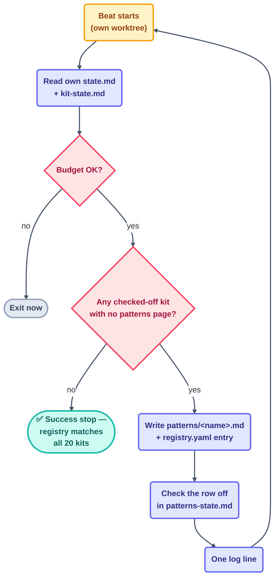

# Loop: `patterns-page-loop` (Day 3)

> A second, **parallel** maker — it never touches `starters/`, so it runs in its own
> git worktree alongside `kit-stamper` rather than waiting for it. For every kit
> `kit-stamper` checks off, it writes that kit's spec page and registry entry.

## The six parts

| Part | This loop |
| --- | --- |
| **Heartbeat** | Conditional — *run-until-done*, self-paced, running in its own worktree. |
| **Body** | May write `patterns/<name>.md` + `patterns/registry.yaml`, plus its own `state.md`. Read-only on [`kit-state.md`](../../../kit-state.md) (what to build next) and `starters/` (never edits it). |
| **Spine** | [`state.md`](state.md) — run history. The work checklist is [`patterns-state.md`](../../../patterns-state.md), mirrored 1:1 from `kit-state.md`'s 20 rows. |
| **Stopping condition** | `patterns/registry.yaml` has one entry, and `patterns/<name>.md` exists, for every row `kit-state.md` has checked off — **and** all 20 are checked off. Provable by `scripts/validate-registry.mjs`. |
| **Checker** | [`audit-loop`](../audit-loop/loop.md)'s `validate-registry.mjs` pass. This loop never grades its own pages. |
| **Human gate** | The human spot-reads a few pattern pages alongside the 3 kits they deep-check, before the Day 3 checkpoint. |

**Level: L2 (assisted — writes `patterns/`)** — same precedent as `kit-stamper`
and `step-writer`: the maker pattern already earned L2 across Day 1 and Day 2, and
the human explicitly started this Day 3 run at L2.

## The prompt

Taken verbatim from [`days-plans/day3-plan.md`](../../../days-plans/day3-plan.md):

```text
/loop In a worktree: for each kit checked off in kit-state.md, write its
patterns/<name>.md spec page and add its registry.yaml entry.
Track in patterns-state.md. Stop when registry matches all kits.
```



## Limits

| Guard | Value |
| --- | --- |
| Max runs/day | 25 |
| Max tokens/day | 300k |
| Sub-agent spawns | 0 |
| Kill switch | `loop-pause-all: on` → exit at start of beat |

Source: [`shared/loop-budget.md`](../../../shared/loop-budget.md).

## Ownership

| Path | This loop's access |
| --- | --- |
| `patterns/*.md`, `patterns/registry.yaml` | **write** (sole owner) |
| `patterns-state.md` | **write** (sole owner) |
| `loops/day3/patterns-page-loop/state.md` | **write** (sole owner) |
| `shared/loop-run-log.md` | **append-only** |
| `kit-state.md`, `starters/` | read-only |
| every other loop's `state.md` | read-only |

## The three valid stops

- **Success** — `patterns/registry.yaml` and `patterns/` match all 20 checked-off
  rows in `kit-state.md` (per `validate-registry.mjs`).
- **Limit** — 25 runs or 300k tokens.
- **No progress** — nothing new to write for 3 consecutive beats (i.e.
  `kit-stamper` hasn't checked off a new kit and this loop has already caught up).
