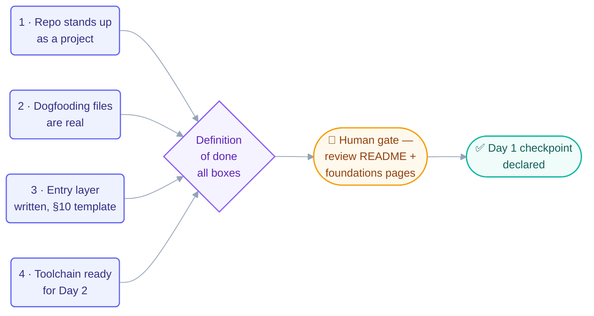

# Goal — Day 1: Repo Foundation + Tracks + Prerequisites

> Shared by all Day 1 loops. Read-only for loops; only the human edits this file.
> Source: `loop-plan.md` §25 (Day 1) and `days-plans/day1-plan.md`.

## The goal

By the end of Day 1 the repository exists as a real, GitHub-browsable project with its
full skeleton and its entry layer completely written — everything a learner needs
**before** the 14 steps begin.

## The four outcomes

1. **The repo stands up as a project** — MIT `LICENSE`, complete `README.md` (hero,
   badges, nav, quickstart, start-here router), `resources/sources.md` (all 9 sources),
   `CONTRIBUTING.md`, `SECURITY.md`, `CODEOWNERS`, `CITATION.cff`, populated `.github/`.
2. **The repo dogfoods its own discipline** — real (not placeholder) `AGENTS.md`,
   `CLAUDE.md`, `LOOP.md`, `STATE.md`, `loop-budget.md`, `loop-constraints.md`,
   `loop-run-log.md`.
3. **The entry layer of the course is written** — `docs/start-here.md`,
   `docs/learning-tracks.md`, all 3 `docs/prerequisites/` pages, all 6
   `docs/00-foundations/` pages, each following the §10 page template.
4. **The toolchain is ready for Day 2** — skills pulled and verified; empty scaffold for
   `docs/part-1`…`part-6`, `patterns/`, `starters/_template/`, `skills/`, `templates/`,
   `examples/`, `stories/`, `assets/`, `scripts/`.

## How the outcomes become "done"

## Definition of done (the provable stopping condition)

- [ ] Repo browsable on GitHub with **no broken relative links**
- [ ] Tracks map, prerequisites, and foundations pages complete and readable
- [ ] Every entry-layer page follows the §10 template
- [ ] Dogfooding files contain real content
- [ ] A stranger landing on `README.md` can navigate to `start-here.md` and begin
- [ ] Human has reviewed `README.md` and the foundations pages (human gate)

## Today's human jobs

- Write the `README.md` hero yourself (the face of the project)
- Read the checker loop's findings every hour or two
- Commit at the checkpoint
