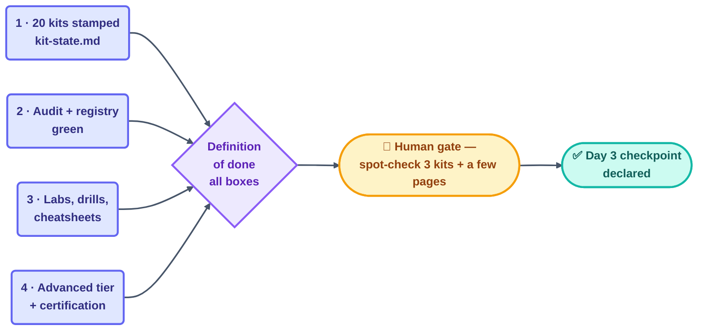

# Goal — Day 3: Loop Library + Labs + Advanced Tier + Certification

> Shared by all Day 3 loops. Read-only for loops; only the human edits this file.
> Source: `loop-plan.md` §15 and `days-plans/day3-plan.md`.
> (Day 1 and Day 2 goals were met and their checkpoints declared — see `STATE.md`.)

## The goal

By the end of Day 3, Deliverable 1 (the full GitHub learning system, T1 → T4) is
feature-complete and production-ready: the 20-loop core library exists, every kit
passes a deterministic audit, the practice content and ultra-pro tier are written,
and all three quality gates are green.

## The four outcomes

1. **The 20-loop core library is stamped** — the 7 original loops plus 13 curated
   from Forward Future's Loop Library (`kit-state.md` is the full list and source
   for each), each with a full multi-tool kit and a `Source:` line crediting where
   its content came from.
2. **Every kit passes a deterministic audit** — `loop-ready-audit.mjs` PASS on all
   20, and `patterns/registry.yaml` matches them exactly (`validate-registry.mjs`
   PASS).
3. **The practice content exists** — 8 labs + 3 drills + reference `solutions/`,
   the Routines appendix, and 6 tool cheatsheets.
4. **The ultra-pro tier + certification exist** — 7 `advanced/` pages, the final
   exam, the capstone rubric, and the Loop Ready certification.

## How the outcomes become "done"

## Definition of done (the provable stopping condition)

- [ ] All 20 rows in `kit-state.md` are checked off
- [ ] `node scripts/loop-ready-audit.mjs` exits 0 for every kit
- [ ] `node scripts/validate-registry.mjs` exits 0 (registry matches all 20 kits)
- [ ] Every item in the Day 3 section of `STATE.md` (labs, drills, cheatsheets,
      advanced tier, assessments) is checked and passes `template-checker`
- [ ] No broken relative links anywhere in the new paths (link-check clean)
- [ ] Human has spot-checked 3 random kits and declared the Day 3 checkpoint

## Today's human jobs

- Design and approve `starters/_template/` quality (already in place — spot-check it)
- Deep-check 3 random stamped kits, especially the borrowed-prompt ones
- Read `review-notes.md`; any FAIL sends that kit back onto `kit-stamper`'s list
- Watch the aggregate spend in `shared/loop-budget.md`; pause
  `labs-and-advanced-loop` first if it's burning too fast (lowest fleet priority)
- Decide any Group-B kit whose borrowed prompt needs trimming before commit
- Declare the Day 3 checkpoint (only you can)
