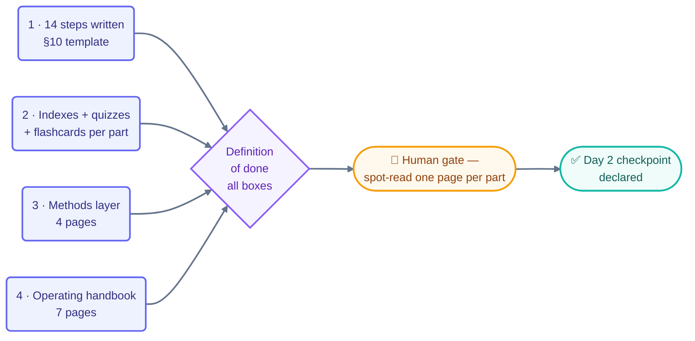

# Goal — Day 2: Write the Full 14-Step Course + Assessments

> Shared by all Day 2 loops. Read-only for loops; only the human edits this file.
> Source: `loop-plan.md` §10–§14 and `days-plans/day2-plan.md`.
> (The Day 1 goal was met and its checkpoint declared 2026-07-16 — see `STATE.md`.)

## The goal

By the end of Day 2 the entire conceptual course — Parts 1–6, all 14 steps, the
methods pages, and the operating handbook — is complete and readable on GitHub, with
a quiz and flashcards for every part.

## The four outcomes

1. **The 14 steps are written** — every step page in `docs/part-1`…`part-6`
   (including 13a/13b and the Part 6 companions: cost-management, verification,
   the-three-nested-loops), each following the §10 template.
2. **Every part is navigable and assessed** — a `README.md` index, a `quiz.md`
   (5 questions + revealed answers), and a `flashcards.md` (10 cards) per part
   (part 5: quiz only).
3. **The methods layer exists** — `make-your-own-loop` (the A–F method),
   `loop-design-checklist`, `pattern-picker`, `decision-framework`.
4. **The operating handbook exists** — `operating-loops`, `safety`, `observability`,
   `failure-modes`, `anti-patterns`, `recovery-playbook`, `multi-loop`.

## How the outcomes become "done"

## Definition of done (the provable stopping condition)

- [ ] Every page on the `step-writer` checklist exists and carries all §10 sections
- [ ] `template-checker` shows PASS on every page, zero open FAILs
- [ ] Six `quiz.md` + five `flashcards.md` exist and PASS
- [ ] No broken relative links anywhere in `docs/` (link-check clean)
- [ ] `markdownlint` clean under the CI globs
- [ ] Human has spot-read one page per part (human gate)

## Today's human jobs

- Spot-read one page per part — you own content *quality*; the checker only owns shape
- Read the `template-checker` verdicts and relay any FAILs to the maker
- Declare the Day 2 checkpoint (only you can)
